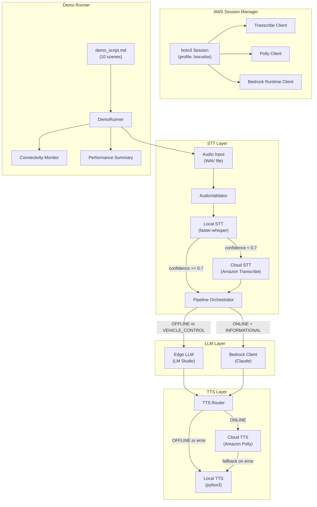

# Design Document: Bedrock STT/TTS Integration

## Overview

This design integrates Amazon Transcribe (STT) and Amazon Polly (TTS) into the Speechless voice assistant pipeline, replacing the current OpenAI Whisper cloud fallback and adding natural-sounding cloud TTS alongside the existing pyttsx3 offline engine. It also ensures real LLM requests flow through both edge (LM Studio) and cloud (Bedrock) paths during the scripted demo, and introduces a Demo Runner that processes pre-recorded WAV files through the complete pipeline.

The design follows three core principles:
1. **Unified AWS session** — A single boto3 Session provides Transcribe, Polly, and Bedrock Runtime clients, all authenticated via the "losrudos" profile.
2. **Graceful degradation** — Any cloud service failure is isolated; the system falls back to local STT/TTS without interrupting the pipeline.
3. **Demo reproducibility** — Pre-recorded WAV files drive deterministic, repeatable end-to-end runs through all 10 scripted scenes.

## Architecture



## Components and Interfaces

### 1. AWSSessionManager

Centralizes AWS credential management and client creation.

```python
class AWSSessionManager:
    """Creates and holds a single boto3 Session and all derived AWS clients."""

    def __init__(self, profile: str = "losrudos", region: str = "us-east-1"):
        ...

    @property
    def transcribe_client(self) -> Optional[Any]: ...
    @property
    def polly_client(self) -> Optional[Any]: ...
    @property
    def bedrock_client(self) -> Optional[Any]: ...

    def is_service_available(self, service: str) -> bool: ...
```

**Design decisions:**
- Single session avoids multiple credential lookups and keeps auth consistent.
- Each client is created independently so one failure doesn't prevent others.
- Exposed as properties with `Optional` return — `None` means unavailable.

### 2. TranscribeSTT (replaces CloudSTT)

New cloud STT module using Amazon Transcribe instead of OpenAI Whisper.

```python
class TranscribeSTT:
    """Cloud STT using Amazon Transcribe."""

    def __init__(self, client: Any, timeout: float = 5.0): ...

    def transcribe(self, audio_samples: np.ndarray, sample_rate: int = 16000) -> Optional[TranscriptionResult]: ...

    @staticmethod
    def numpy_to_wav_bytes(samples: np.ndarray, sample_rate: int = 16000) -> bytes: ...
```

**Interface contract:**
- Input: numpy float32 array (16kHz, mono)
- Output: `TranscriptionResult(text, confidence, source="cloud")` or `None`
- Converts float32→16-bit PCM WAV before sending to Transcribe
- 5-second timeout; returns `None` on any error

### 3. PollyTTS (new Cloud TTS)

Cloud TTS module using Amazon Polly alongside existing pyttsx3.

```python
class PollyTTS:
    """Cloud TTS using Amazon Polly neural voices."""

    def __init__(self, client: Any, voice_id: str = "Joanna", timeout: float = 5.0): ...

    def synthesize(self, text: str) -> Optional[bytes]: ...
    def truncate_text(self, text: str, max_chars: int = 3000) -> str: ...
```

**Interface contract:**
- Input: text string (up to 3000 chars; truncated at last sentence boundary if longer)
- Output: PCM bytes (signed 16-bit LE, 16kHz) or `None` on error
- Uses neural engine, `Joanna` voice (female, en-US), `SampleRate="16000"`
- 5-second timeout; returns `None` on any error

### 4. TTSRouter

Routes TTS output between cloud (Polly) and local (pyttsx3) based on connectivity and availability.

```python
class TTSRouter:
    """Routes TTS to Polly (online) or pyttsx3 (offline/fallback)."""

    def __init__(self, polly_tts: Optional[PollyTTS], local_tts: ResponseEngine): ...

    def speak(self, text: str, mode: ProcessingMode) -> None: ...
```

**Routing logic:**
- OFFLINE → always local
- ONLINE → attempt Polly, fallback to local on error

### 5. AudioValidator

Validates and optionally converts audio input files.

```python
@dataclass
class AudioValidationResult:
    samples: Optional[np.ndarray]
    sample_rate: int
    error: Optional[str]
    converted: bool

class AudioValidator:
    """Validates WAV format, duration, size; converts non-standard formats."""

    MAX_FILE_SIZE_BYTES: int = 15 * 1024 * 1024  # 15 MB
    MIN_DURATION_SEC: float = 0.5
    MAX_DURATION_SEC: float = 30.0
    EXPECTED_SAMPLE_RATE: int = 16000
    EXPECTED_CHANNELS: int = 1
    EXPECTED_SAMPLE_WIDTH: int = 2  # 16-bit

    def validate_and_load(self, file_path: str) -> AudioValidationResult: ...
    def convert_audio(self, file_path: str) -> AudioValidationResult: ...
```

**Validation order:**
1. File exists and is readable
2. File size ≤ 15 MB
3. WAV format detection
4. If non-standard format → attempt conversion (10s timeout)
5. Duration in [0.5, 30] seconds
6. Return float32 samples or error

### 6. Enhanced BedrockClient

Extends the existing `BedrockClient` with telemetry-aware system prompts.

```python
class BedrockClient:
    # ... existing methods ...

    def converse_with_telemetry(
        self,
        user_message: str,
        telemetry: Optional[dict] = None,
        history: Optional[list[ConversationMessage]] = None,
    ) -> BedrockResponse: ...

    def _build_system_prompt(self, telemetry: Optional[dict]) -> Optional[str]: ...
```

**Telemetry system prompt logic:**
- If all telemetry fields are `None` → omit system prompt
- If at least one field is non-None → include only non-None fields
- After successful request with injected context → clear context
- After failed request → retain context for retry

### 7. Enhanced EdgeLLMClient

Ensures real LLM requests with proper conversation history management.

```python
class EdgeLLMClient:
    # ... existing methods ...

    def generate_with_history(
        self,
        user_message: str,
        conversation_history: list[dict],
        max_history_turns: int = 20,
    ) -> EdgeLLMResponse: ...
```

**History management:**
- Caps at 20 prior turns
- Trims oldest first when exceeding limit
- Always includes system prompt

### 8. DemoRunner

Orchestrates the scripted demo end-to-end using pre-recorded WAV files.

```python
@dataclass
class SceneResult:
    scene_number: int
    passed: bool
    stt_latency_ms: float
    classification_latency_ms: float
    llm_latency_ms: float
    tts_latency_ms: float
    total_latency_ms: float
    error: Optional[str] = None
    performance_target_met: bool = True

class DemoRunner:
    """Runs the 10-scene scripted demo with pre-recorded audio files."""

    def __init__(
        self,
        pipeline: PipelineOrchestrator,
        audio_dir: str,
        connectivity_monitor: ConnectivityMonitor,
    ): ...

    async def run_all_scenes(self) -> list[SceneResult]: ...
    async def run_scene(self, scene_number: int, audio_path: str, ...) -> SceneResult: ...
    def print_summary(self, results: list[SceneResult]) -> None: ...
```

**Performance targets:**
- Vehicle control: <1000ms end-to-end
- Informational query: <5000ms
- Edge LLM: <3000ms
- Classification: <100ms

## Data Models

### TranscriptionResult (existing, unchanged)

```python
@dataclass
class TranscriptionResult:
    text: str
    confidence: float  # 0.0 to 1.0
    source: str  # "local" or "cloud"
```

### BedrockResponse (existing, unchanged)

```python
@dataclass
class BedrockResponse:
    text: str
    model: str
    success: bool
    error_message: Optional[str] = None
```

### New: AudioValidationResult

```python
@dataclass
class AudioValidationResult:
    samples: Optional[np.ndarray]  # float32, 16kHz, mono
    sample_rate: int
    duration_seconds: float
    error: Optional[str]
    converted: bool  # True if format conversion was applied
```

### New: SceneResult

```python
@dataclass
class SceneResult:
    scene_number: int
    passed: bool
    stt_latency_ms: float
    classification_latency_ms: float
    llm_latency_ms: float
    tts_latency_ms: float
    total_latency_ms: float
    error: Optional[str] = None
    performance_target_met: bool = True
```

### New: SceneConfig

```python
@dataclass
class SceneConfig:
    scene_number: int
    audio_file: str
    expected_mode: ProcessingMode
    connectivity_transition: Optional[ProcessingMode] = None  # Set mode before scene
    performance_target_ms: float = 5000.0
    description: str = ""
```

### Updated: AppConfig additions

```python
@dataclass
class AppConfig:
    # ... existing fields ...

    # New fields for this feature
    aws_tts_voice_id: str = "Joanna"        # Already exists
    tts_provider: str = "local_pyttsx3"      # Already exists, will also support "aws"
    asr_provider: str = "local_whisper"      # Already exists, will also support "aws"
    transcribe_timeout: float = 5.0
    polly_timeout: float = 5.0
    edge_llm_timeout: float = 10.0
    max_conversation_turns: int = 20
    polly_max_text_chars: int = 3000
    audio_max_file_size_mb: int = 15
    audio_min_duration_sec: float = 0.5
    audio_max_duration_sec: float = 30.0
```

## Correctness Properties

*A property is a characteristic or behavior that should hold true across all valid executions of a system — essentially, a formal statement about what the system should do. Properties serve as the bridge between human-readable specifications and machine-verifiable correctness guarantees.*

### Property 1: Audio float32-to-WAV conversion preserves sample count and format

*For any* numpy float32 array representing audio samples (length 800 to 480000, values in [-1.0, 1.0]), converting to WAV bytes and reading back the WAV header SHALL yield sample_rate=16000, channels=1, sample_width=2, and a frame count equal to the input array length.

**Validates: Requirements 1.5**

### Property 2: Transcribe response parsing produces correct TranscriptionResult

*For any* valid Amazon Transcribe response containing a transcript string and a confidence float in [0.0, 1.0], the `TranscribeSTT` response parser SHALL return a `TranscriptionResult` where text equals the transcript, confidence equals the provided value, and source equals "cloud".

**Validates: Requirements 1.2**

### Property 3: Polly error triggers fallback to local TTS

*For any* response text and any Polly error condition (timeout, service error, connection error), the TTSRouter SHALL invoke local TTS with the identical text that was originally passed to cloud TTS.

**Validates: Requirements 2.4**

### Property 4: Offline mode routes exclusively to local TTS

*For any* response text while ProcessingMode is OFFLINE, the TTSRouter SHALL invoke only the local TTS engine and SHALL NOT invoke the Polly client.

**Validates: Requirements 2.5**

### Property 5: Text truncation preserves sentence boundaries and length limit

*For any* text string exceeding 3000 characters that contains at least one sentence-ending punctuation mark, the `truncate_text` function SHALL return a string that: (a) has length ≤ 3000, (b) ends with a sentence-ending character (., !, or ?), and (c) is a prefix of the original text (no reordering).

**Validates: Requirements 2.6**

### Property 6: Edge LLM messages always include system prompt

*For any* user message string and any conversation history (0-30 turns), the `build_request_messages` output SHALL have a first element with role="system" containing "vehicle" or "voice assistant" (case-insensitive).

**Validates: Requirements 3.2**

### Property 7: Conversation history is capped at 20 turns

*For any* conversation history of N turns (where N > 20) and any new user message, the `generate_with_history` method SHALL include exactly 20 history turns in the request (the most recent 20), trimming oldest first.

**Validates: Requirements 3.3**

### Property 8: Telemetry system prompt includes only non-None fields

*For any* telemetry dictionary with fields {latitude, longitude, fuel_level, connectivity_state} where at least one field is non-None, the constructed system prompt SHALL contain string representations of all non-None fields and SHALL NOT reference any field whose value is None. If all fields are None, no system prompt SHALL be included.

**Validates: Requirements 4.2, 4.3**

### Property 9: Injected context cleared on success, retained on failure

*For any* non-empty injected context list, after a successful converse call the Bedrock client's injected context SHALL be empty. After a failed converse call, the injected context SHALL be unchanged from before the call.

**Validates: Requirements 4.5**

### Property 10: WAV file read produces float32 array with correct properties

*For any* valid WAV file (16kHz, mono, 16-bit PCM, duration in [0.5, 30]s, size ≤ 15MB), the `AudioValidator.validate_and_load` method SHALL return an `AudioValidationResult` with a non-None float32 samples array whose length equals sample_rate × duration_seconds (within ±1 sample), and error=None.

**Validates: Requirements 5.1, 7.1**

### Property 11: AWS session failure degrades all cloud services

*For any* credential error during boto3 Session initialization, all three service availability flags (transcribe, polly, bedrock) SHALL be set to False, and the pipeline SHALL operate in local-only mode without raising an exception.

**Validates: Requirements 6.4**

### Property 12: Individual client failure degrades only that service

*For any* single AWS service (Transcribe, Polly, or Bedrock Runtime) that fails during client creation while the other two succeed, only the failing service's availability flag SHALL be False, and the other two services SHALL remain available.

**Validates: Requirements 6.5**

### Property 13: Audio file validation rejects invalid files correctly

*For any* audio file metadata (duration in seconds, file size in bytes), the AudioValidator SHALL accept the file if and only if: duration ∈ [0.5, 30.0] AND size ≤ 15,728,640 bytes (15 MB). Files outside these bounds SHALL be rejected with an error message indicating the violated constraint.

**Validates: Requirements 7.1, 7.4, 7.5, 7.6**

### Property 14: Audio format conversion produces standard output

*For any* WAV file with non-standard format (sample rate ≠ 16000 OR channels ≠ 1 OR sample width ≠ 2) but valid audio content, the `convert_audio` method SHALL produce output with sample_rate=16000, channels=1, and sample_width=2, with the `converted` flag set to True.

**Validates: Requirements 7.2**

## Error Handling

### Error Categories and Responses

| Error Source | Condition | Behavior | Fallback |
|---|---|---|---|
| AWS Session | Invalid profile/credentials | Log error, mark all cloud services unavailable | Local STT + Local TTS |
| Transcribe | Timeout (>5s) or service error | Return `None` | Use local STT result |
| Polly | Timeout (>5s) or service error | Return `None` | Use local TTS (pyttsx3) |
| Bedrock | Timeout (>5s) or service error | Return `BedrockResponse(success=False)` | Return error message to user |
| Edge LLM | Timeout (>10s), connection refused, HTTP error | Return `EdgeLLMResponse(success=False)` | Inform user of failure |
| Audio File | Missing, unreadable, wrong format | Return `AudioValidationResult(error=...)` | Skip scene, continue demo |
| Audio File | Out of duration/size bounds | Return validation error | Skip scene, continue demo |
| Conversion | Fails or times out (>10s) | Return error with format requirements | Skip scene |

### Error Propagation Strategy

1. **No exceptions escape to the user** — All errors are caught and returned as structured results with `success=False` or `error` fields.
2. **Graceful degradation** — Cloud failures never crash the pipeline; the system continues with local alternatives.
3. **Logging** — All errors are logged with context (service name, error type, timestamp) but logging failures themselves are non-blocking.
4. **Demo continuity** — The Demo Runner skips failed scenes for file-related problems and continues to the next scene, reporting failures in the final summary.

## Testing Strategy

### Property-Based Tests (Hypothesis)

This feature is well-suited for property-based testing because it involves:
- Data transformations (audio format conversion, WAV encoding/decoding)
- Input validation with clear boundaries (duration, size, format)
- Universal routing logic (mode-based TTS selection)
- Text processing (truncation at sentence boundaries)
- State management (context injection/clearing)

**Configuration:**
- Library: [Hypothesis](https://hypothesis.readthedocs.io/) (already in dev dependencies)
- Minimum iterations: 100 per property
- Tag format: `Feature: bedrock-stt-tts-integration, Property {N}: {title}`

Each of the 14 correctness properties above maps to a single property-based test.

### Unit Tests (Example-Based)

- Transcribe client construction with correct profile/region (smoke)
- Polly client uses neural engine, correct voice, sample rate (smoke)
- Edge LLM successful response extraction (already exists)
- BedrockClient authentication configuration (smoke)
- DemoRunner scene sequencing (integration mock)

### Integration Tests

- Full pipeline: WAV → STT → Classification → LLM → TTS (mocked AWS)
- Demo Runner: All 10 scenes with mocked services
- Connectivity transition: OFFLINE → ONLINE with context forwarding
- Performance timing measurement accuracy

### Test Organization

```
tests/
├── test_transcribe_stt.py        # Properties 1, 2
├── test_polly_tts.py             # Properties 3, 4, 5
├── test_edge_llm.py              # Properties 6, 7 (extends existing)
├── test_bedrock_client.py        # Properties 8, 9 (extends existing)
├── test_audio_validator.py       # Properties 10, 13, 14
├── test_aws_session_manager.py   # Properties 11, 12
├── test_demo_runner.py           # Integration tests
└── test_tts_router.py            # Properties 3, 4
```
