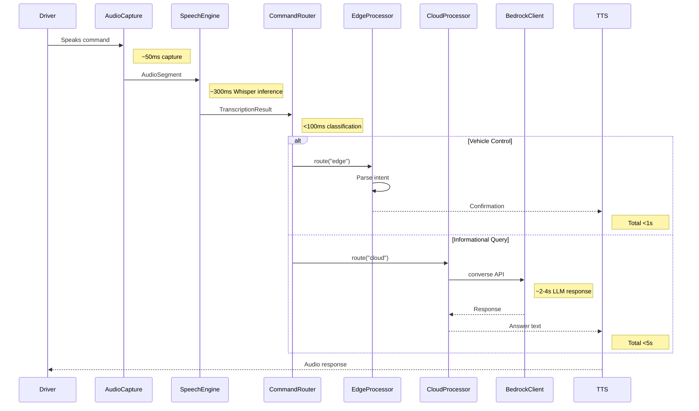
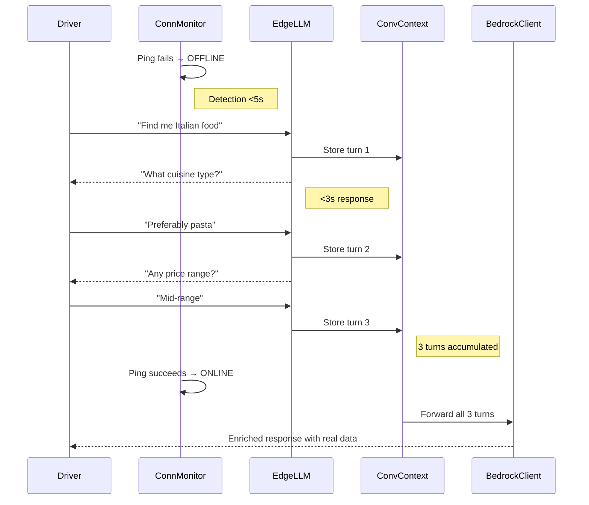
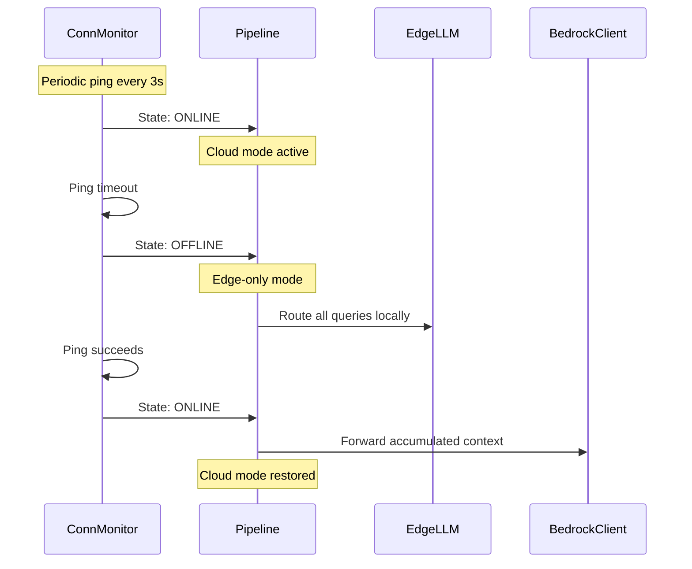
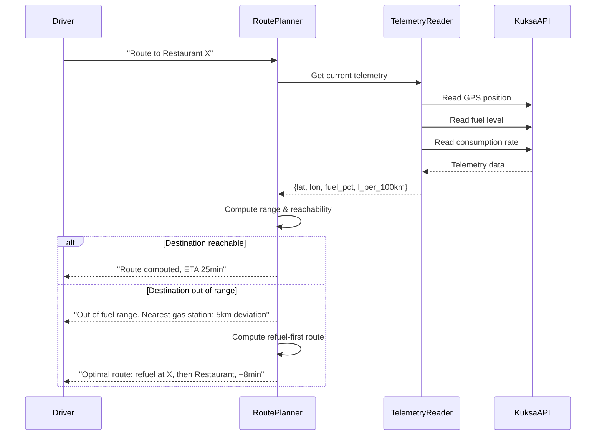
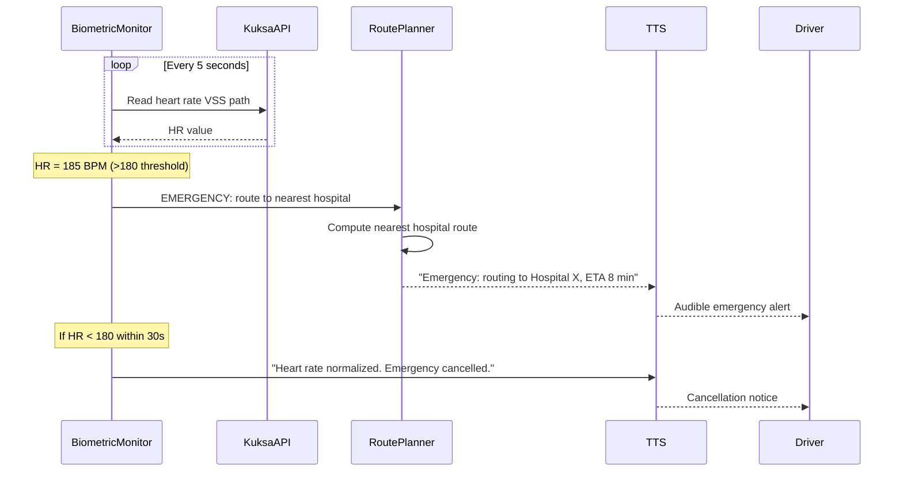

# Design Document

## Overview

Speechless is a modular, connectivity-aware, edge-first in-vehicle voice assistant that intelligently routes commands between local edge processing and AWS Bedrock cloud services. The architecture supports dual edge deployment targets (LM Studio for development, NVIDIA Jetson TensorRT for production) via a unified OpenAI-compatible client, and seamlessly transitions between online and offline modes based on real-time connectivity monitoring.

The system follows a pipeline architecture: Audio → STT → Command Router → Edge/Cloud Processor → Response. Vehicle control commands execute locally for sub-second latency; informational queries route to the cloud for rich responses. When offline, the Edge LLM handles all queries with multi-turn conversation support, forwarding accumulated context to AWS Bedrock upon reconnection.

Additionally, the system integrates vehicle telemetry (GPS, fuel, biometrics) for fuel-aware route planning, multi-constraint route optimization, and emergency biometric response.

## Architecture

```
┌────────────────────────────────────────────────────────────────────────────────┐
│                              Voice Assistant                                   │
│                                                                                │
│  ┌──────────┐    ┌────────────────┐    ┌───────────────────────────┐           │
│  │  Audio   │───▶│ Speech Engine  │───▶│     Command Router        │           │
│  │ Capture  │    │ (Whisper/Cloud)│    │  (keyword classification) │           │
│  └──────────┘    └────────────────┘    └───────────┬───────────────┘           │
│                                                    │                           │
│                    ┌───────────────────┐           │                           │
│                    │Connectivity       │           │                           │
│                    │Monitor (ping)     │───────────┼─── mode switch ───┐       │
│                    └───────────────────┘           │                   │       │
│                          ┌─────────────────────────┼───────────────────┘       │
│                          │                         │                           │
│                          ▼                         ▼                           │
│              ┌───────────────────┐    ┌────────────────────────┐               │
│              │  Edge Processor   │    │   Cloud Processor      │               │
│              │                   │    │                        │               │
│              │ ┌───────────────┐ │    │ ┌────────────────────┐ │               │
│              │ │ Edge LLM      │ │    │ │ Bedrock Client     │ │               │
│              │ │ (OpenAI API)  │ │    │ │ (boto3 converse)   │ │               │
│              │ │ ┌───────────┐ │ │    │ │ Profile: losrudos  │ │               │
│              │ │ │LM Studio  │ │ │    │ └────────────────────┘ │               │
│              │ │ │  (dev)    │ │ │    └────────────────────────┘               │
│              │ │ ├───────────┤ │ │                                             │
│              │ │ │Jetson TRT │ │ │    ┌────────────────────────┐               │
│              │ │ │  (prod)   │ │ │    │ Conversation Context   │               │
│              │ │ └───────────┘ │ │    │ (offline history queue)│               │
│              │ └───────────────┘ │    └────────────────────────┘               │
│              │ ┌───────────────┐ │                                             │
│              │ │Intent Parser  │ │                                             │
│              │ └───────┬───────┘ │                                             │
│              │ ┌───────▼───────┐ │                                             │
│              │ │Vehicle Ctrl   │ │    ┌────────────────────────┐               │
│              │ │(Kuksa gRPC)   │ │    │  Telemetry Reader      │               │
│              │ └───────────────┘ │    │  (GPS, Fuel, metrics..)│               │
│              └───────────────────┘    └───────────┬────────────┘               │
│                          │                        │                            │
│                          │            ┌───────────▼────────────┐               │
│                          │            │  Route Planner         │               │
│                          │            │  (fuel-aware, multi-   │               │
│                          │            │   constraint routing)  │               │
│                          │            └────────────────────────┘               │
│                          │                                                     │
│                          │            ┌────────────────────────┐               │
│                          │            │  Biometric Monitor     │               │
│                          │            │  (HR → emergency route)│               │
│                          │            └────────────────────────┘               │
│                          ▼                                                     │
│              ┌───────────────────┐    ┌────────────────────┐                   │
│              │  Response Engine  │◀───│   TTS Engine       │                   │
│              │  (confirmation)   │    │  (gTTS / pyttsx3)  │                   │
│              └───────────────────┘    └────────────────────┘                   │
└────────────────────────────────────────────────────────────────────────────────┘
                          │
                          ▼
┌────────────────────────────────────────────────────────────────────────────────┐
│                  Kuksa Databroker (Docker Container)                           │
│                  gRPC :55555 — VSS signals                                     │
│  Paths: Vehicle.Cabin.HVAC.*, Vehicle.CurrentLocation.*,                       │
│         Vehicle.Powertrain.FuelSystem.*, Vehicle.Occupant.*.HeartRate          │
└────────────────────────────────────────────────────────────────────────────────┘
```

## Architectural Diagrams

### .drawio Structure

The project includes a hyperdetailed `.drawio` architectural diagram at `docs/architecture.drawio` with the following layers:

1. **Edge Layer** — Jetson/LM Studio inference, Whisper STT, Intent Parser, Vehicle Controller
2. **Cloud Layer** — AWS Bedrock (converse API), real-time data services
3. **Vehicle Layer** — Kuksa Databroker, VSS signal paths, telemetry sensors
4. **Orchestration Layer** — Pipeline orchestrator, Connectivity Monitor, Conversation Context
5. **Data Flow** — Arrows depicting request/response paths, mode transitions, context forwarding

The diagram clearly distinguishes edge components (blue) from cloud components (orange) and vehicle components (green).

### Mermaid Sequence Diagrams

#### Speech-to-Command Pipeline (Online)



#### Offline Conversational Follow-up



#### Connectivity Transition



#### Fuel-Aware Route Planning



#### Emergency Biometric Response




## Technology Stack

| Layer | Technology | Version | Notes |
|-------|-----------|---------|-------|
| Package Manager | uv | ≥0.4 | Replaces pip/setuptools |
| Build Backend | hatchling | ≥1.21 | In pyproject.toml |
| Python | CPython | 3.11+ | Runtime |
| STT (Edge) | faster-whisper | ≥1.0 | CTranslate2-based local Whisper |
| STT (Cloud fallback) | openai | ≥1.30 | Whisper API fallback |
| Edge LLM Client | openai | ≥1.30 | Unified OpenAI-compatible client (LM Studio + Jetson) |
| Cloud LLM | boto3 | ≥1.34 | AWS Bedrock converse API, profile "losrudos" |
| TTS | pyttsx3 | ≥2.90 | Offline TTS, no cloud dependency |
| Vehicle API | kuksa-client | ≥0.4 | Eclipse Kuksa Python gRPC client |
| Audio Capture | sounddevice | ≥0.4 | PortAudio bindings |
| HTTP Client | httpx | ≥0.27 | Connectivity ping checks |
| Container Runtime | Docker Compose | v2 | Kuksa databroker |
| Kuksa Databroker | ghcr.io/eclipse-kuksa/kuksa-databroker | 0.4.4 | VSS signals over gRPC |
| Testing | pytest + hypothesis | ≥8.0 / ≥6.100 | Property-based testing |

## Project Structure

```
Speechless/
├── pyproject.toml              # uv/hatchling build, all deps
├── uv.lock                     # Lockfile
├── docker-compose.yml          # Kuksa databroker
├── README.md
├── docs/
│   ├── architecture.drawio     # Hyperdetailed architectural diagram
│   └── diagrams/               # Exported PNGs of diagrams
├── src/
│   └── speechless/
│       ├── __init__.py
│       ├── main.py             # Entry point, pipeline orchestrator
│       ├── config.py           # Configuration (thresholds, endpoints, targets)
│       ├── models.py           # Data models (Command, Intent, Telemetry, etc.)
│       ├── speech/
│       │   ├── __init__.py
│       │   ├── capture.py      # Audio capture (sounddevice)
│       │   ├── stt_local.py    # Local Whisper STT
│       │   └── stt_cloud.py    # Cloud STT fallback
│       ├── router/
│       │   ├── __init__.py
│       │   └── classifier.py   # Command classification & routing
│       ├── edge/
│       │   ├── __init__.py
│       │   ├── intent_parser.py    # NLU intent extraction
│       │   ├── vehicle_controller.py  # Kuksa gRPC actuation
│       │   └── edge_llm.py     # OpenAI-compatible edge LLM client
│       ├── cloud/
│       │   ├── __init__.py
│       │   └── bedrock_client.py  # AWS Bedrock converse API client
│       ├── connectivity/
│       │   ├── __init__.py
│       │   └── monitor.py      # Periodic connectivity ping & mode switching
│       ├── context/
│       │   ├── __init__.py
│       │   └── conversation.py # Offline conversation context manager
│       ├── telemetry/
│       │   ├── __init__.py
│       │   ├── reader.py       # GPS, fuel, biometric VSS reading
│       │   └── biometric.py    # Heart rate monitoring & emergency trigger
│       ├── routing/
│       │   ├── __init__.py
│       │   └── planner.py      # Fuel-aware, multi-constraint route planner
│       ├── response/
│       │   ├── __init__.py
│       │   └── tts.py          # Text-to-speech output
│       └── utils/
│           ├── __init__.py
│           ├── logging.py      # Structured logging
│           └── retry.py        # Exponential backoff utility
└── tests/
    ├── __init__.py
    ├── conftest.py
    ├── test_classifier.py
    ├── test_intent_parser.py
    ├── test_vehicle_controller.py
    ├── test_edge_llm.py
    ├── test_bedrock_client.py
    ├── test_connectivity.py
    ├── test_conversation_context.py
    ├── test_telemetry.py
    ├── test_route_planner.py
    ├── test_biometric.py
    ├── test_retry.py
    └── test_logging.py
```

## Components and Interfaces

### 1. Speech Engine (`speechless.speech`)

#### Audio Capture (`capture.py`)

```python
import numpy as np
import sounddevice as sd
from dataclasses import dataclass


@dataclass
class AudioSegment:
    """Raw audio data from microphone capture."""
    samples: np.ndarray
    sample_rate: int
    duration_seconds: float


class AudioCapture:
    """Captures audio from the vehicle microphone using sounddevice."""

    def __init__(self, sample_rate: int = 16000, chunk_duration: float = 5.0):
        self.sample_rate = sample_rate
        self.chunk_duration = chunk_duration

    def record(self) -> AudioSegment:
        """Record a single audio segment from the default input device."""
        frames = int(self.sample_rate * self.chunk_duration)
        audio = sd.rec(frames, samplerate=self.sample_rate, channels=1, dtype="float32")
        sd.wait()
        return AudioSegment(
            samples=audio.flatten(),
            sample_rate=self.sample_rate,
            duration_seconds=self.chunk_duration,
        )
```

#### Local STT (`stt_local.py`)

```python
from dataclasses import dataclass
from faster_whisper import WhisperModel


@dataclass
class TranscriptionResult:
    """Result from speech-to-text transcription."""
    text: str
    confidence: float  # 0.0 to 1.0
    source: str  # "local" or "cloud"


class LocalSTT:
    """Local Whisper-based speech-to-text using faster-whisper."""

    def __init__(self, model_size: str = "base", confidence_threshold: float = 0.7):
        self.model = WhisperModel(model_size, compute_type="int8")
        self.confidence_threshold = confidence_threshold

    def transcribe(self, audio_samples: np.ndarray) -> TranscriptionResult:
        """Transcribe audio using local Whisper model."""
        segments, info = self.model.transcribe(audio_samples, beam_size=5)
        text_parts = []
        avg_confidence = 0.0
        count = 0
        for segment in segments:
            text_parts.append(segment.text)
            avg_confidence += segment.avg_logprob
            count += 1

        confidence = self._logprob_to_confidence(avg_confidence / max(count, 1))
        return TranscriptionResult(
            text=" ".join(text_parts).strip(),
            confidence=confidence,
            source="local",
        )

    def is_below_threshold(self, result: TranscriptionResult) -> bool:
        """Check if transcription confidence is below the threshold."""
        return result.confidence < self.confidence_threshold

    @staticmethod
    def _logprob_to_confidence(logprob: float) -> float:
        """Convert average log probability to 0-1 confidence score."""
        import math
        return min(1.0, max(0.0, math.exp(logprob)))
```

### 2. Command Router (`speechless.router`)

#### Classifier (`classifier.py`)

```python
from dataclasses import dataclass
from enum import Enum


class CommandCategory(Enum):
    VEHICLE_CONTROL = "vehicle_control"
    INFORMATIONAL = "informational"


@dataclass
class ClassificationResult:
    """Result of command classification."""
    category: CommandCategory
    confidence: float  # 0.0 to 1.0
    matched_keywords: list[str]


class CommandClassifier:
    """Classifies transcribed text as vehicle control or informational."""

    VEHICLE_KEYWORDS = {
        "temperature", "heat", "cool", "ac", "hvac", "warm", "cold",
        "window", "windows", "open", "close",
        "lock", "unlock", "door", "doors",
        "light", "lights", "headlights", "interior",
        "set", "turn on", "turn off", "increase", "decrease",
    }

    def __init__(self, confidence_threshold: float = 0.6):
        self.confidence_threshold = confidence_threshold

    def classify(self, text: str) -> ClassificationResult:
        """Classify text into vehicle control or informational category."""
        text_lower = text.lower()
        words = set(text_lower.split())
        matches = words.intersection(self.VEHICLE_KEYWORDS)

        score = len(matches) / max(len(words), 1)
        confidence = min(1.0, score * 3)

        if confidence >= self.confidence_threshold:
            return ClassificationResult(
                category=CommandCategory.VEHICLE_CONTROL,
                confidence=confidence,
                matched_keywords=list(matches),
            )
        elif confidence < 0.3:
            return ClassificationResult(
                category=CommandCategory.INFORMATIONAL,
                confidence=1.0 - confidence,
                matched_keywords=list(matches),
            )
        else:
            return ClassificationResult(
                category=CommandCategory.INFORMATIONAL,
                confidence=confidence,
                matched_keywords=list(matches),
            )

    def route(self, result: ClassificationResult) -> str:
        """Return the routing destination based on classification."""
        if result.category == CommandCategory.VEHICLE_CONTROL:
            return "edge"
        return "cloud"
```

### 3. Edge Processor (`speechless.edge`)

#### Intent Parser (`intent_parser.py`)

```python
from dataclasses import dataclass
from enum import Enum
from typing import Optional


class VehicleSystem(Enum):
    HVAC = "hvac"
    WINDOWS = "windows"
    DOORS = "doors"
    LIGHTS = "lights"


class Action(Enum):
    SET_TEMPERATURE = "set_temperature"
    OPEN = "open"
    CLOSE = "close"
    LOCK = "lock"
    UNLOCK = "unlock"
    TURN_ON = "turn_on"
    TURN_OFF = "turn_off"


@dataclass
class VehicleIntent:
    """Parsed vehicle control intent."""
    system: VehicleSystem
    action: Action
    parameters: dict  # e.g., {"temperature": 22, "unit": "celsius"}


class IntentParser:
    """Parses natural language vehicle commands into structured intents."""

    def parse(self, text: str) -> Optional[VehicleIntent]:
        """Parse command text into a VehicleIntent. Returns None if unparseable."""
        text_lower = text.lower()

        if any(kw in text_lower for kw in ["temperature", "heat", "cool", "ac", "hvac"]):
            return self._parse_hvac(text_lower)
        if "window" in text_lower:
            return self._parse_window(text_lower)
        if "door" in text_lower or "lock" in text_lower or "unlock" in text_lower:
            return self._parse_door(text_lower)
        if "light" in text_lower:
            return self._parse_light(text_lower)
        return None

    def _parse_hvac(self, text: str) -> VehicleIntent:
        import re
        temp_match = re.search(r"(\d+)", text)
        temp = int(temp_match.group(1)) if temp_match else 22
        return VehicleIntent(
            system=VehicleSystem.HVAC,
            action=Action.SET_TEMPERATURE,
            parameters={"temperature": temp},
        )

    def _parse_window(self, text: str) -> VehicleIntent:
        action = Action.CLOSE if "close" in text else Action.OPEN
        return VehicleIntent(system=VehicleSystem.WINDOWS, action=action, parameters={})

    def _parse_door(self, text: str) -> VehicleIntent:
        action = Action.UNLOCK if "unlock" in text else Action.LOCK
        return VehicleIntent(system=VehicleSystem.DOORS, action=action, parameters={})

    def _parse_light(self, text: str) -> VehicleIntent:
        action = Action.TURN_OFF if "off" in text else Action.TURN_ON
        return VehicleIntent(system=VehicleSystem.LIGHTS, action=action, parameters={})
```

#### Vehicle Controller (`vehicle_controller.py`)

```python
from dataclasses import dataclass
from typing import Optional


@dataclass
class VSSSignal:
    """A Vehicle Signal Specification path and value."""
    path: str
    value: any
    type: str  # "int32", "float", "boolean", "string"


@dataclass
class ActuationResult:
    """Result of a vehicle signal actuation."""
    success: bool
    signal: VSSSignal
    error_message: Optional[str] = None


class VehicleController:
    """Translates intents to Kuksa gRPC calls via VSS paths."""

    VSS_MAPPING = {
        ("hvac", "set_temperature"): VSSSignal(
            path="Vehicle.Cabin.HVAC.Station.Row1.Driver.Temperature",
            value=None, type="int32",
        ),
        ("windows", "open"): VSSSignal(
            path="Vehicle.Cabin.Door.Row1.DriverSide.Window.Position",
            value=100, type="uint8",
        ),
        ("windows", "close"): VSSSignal(
            path="Vehicle.Cabin.Door.Row1.DriverSide.Window.Position",
            value=0, type="uint8",
        ),
        ("doors", "lock"): VSSSignal(
            path="Vehicle.Cabin.Door.Row1.DriverSide.IsLocked",
            value=True, type="boolean",
        ),
        ("doors", "unlock"): VSSSignal(
            path="Vehicle.Cabin.Door.Row1.DriverSide.IsLocked",
            value=False, type="boolean",
        ),
        ("lights", "turn_on"): VSSSignal(
            path="Vehicle.Body.Lights.DirectionIndicator.Left.IsSignaling",
            value=True, type="boolean",
        ),
        ("lights", "turn_off"): VSSSignal(
            path="Vehicle.Body.Lights.DirectionIndicator.Left.IsSignaling",
            value=False, type="boolean",
        ),
    }

    def __init__(self, kuksa_host: str = "localhost", kuksa_port: int = 55555):
        self.kuksa_host = kuksa_host
        self.kuksa_port = kuksa_port
        self._channel = None

    def intent_to_signal(self, intent: "VehicleIntent") -> Optional[VSSSignal]:
        """Map a VehicleIntent to the corresponding VSS signal."""
        key = (intent.system.value, intent.action.value)
        signal = self.VSS_MAPPING.get(key)
        if signal is None:
            return None
        if intent.action.value == "set_temperature":
            return VSSSignal(
                path=signal.path,
                value=intent.parameters.get("temperature", 22),
                type=signal.type,
            )
        return signal

    @staticmethod
    def format_vss_path(path: str) -> str:
        """Validate and format a VSS path string."""
        if not path.startswith("Vehicle."):
            raise ValueError(f"Invalid VSS path: must start with 'Vehicle.': {path}")
        parts = path.split(".")
        if len(parts) < 3:
            raise ValueError(f"Invalid VSS path: too few segments: {path}")
        return path

    def generate_error_message(self, error: Exception, intent: "VehicleIntent") -> str:
        """Generate a user-friendly error message for a failed actuation."""
        system_name = intent.system.value.replace("_", " ")
        action_name = intent.action.value.replace("_", " ")
        return (
            f"Unable to {action_name} the {system_name}. "
            f"Reason: {type(error).__name__}: {str(error)}"
        )
```

#### Edge LLM Client (`edge_llm.py`)

```python
from dataclasses import dataclass
from typing import Optional
from openai import OpenAI


@dataclass
class EdgeLLMConfig:
    """Configuration for the edge LLM target."""
    target: str  # "lmstudio" or "jetson"
    lmstudio_url: str = "http://localhost:1234/v1"
    jetson_url: str = "http://jetson-device:8080/v1"
    model_name: str = "local-model"
    timeout: float = 10.0


@dataclass
class EdgeLLMResponse:
    """Response from edge LLM inference."""
    text: str
    model: str
    success: bool
    error_message: Optional[str] = None


class EdgeLLMClient:
    """Unified OpenAI-compatible client for edge LLM inference.
    
    Supports dual targets:
    - LM Studio (localhost, OpenAI-compatible) for development
    - NVIDIA Jetson (TensorRT/CUDA, OpenAI-compatible) for production
    """

    def __init__(self, config: EdgeLLMConfig):
        self.config = config
        base_url = config.lmstudio_url if config.target == "lmstudio" else config.jetson_url
        self.client = OpenAI(
            base_url=base_url,
            api_key="not-needed",  # Local models don't require API keys
            timeout=config.timeout,
        )
        self._ready = False

    def validate_connectivity(self) -> bool:
        """Validate connectivity to the configured endpoint. Returns readiness."""
        try:
            # Attempt a minimal request to verify the endpoint is responsive
            self.client.models.list()
            self._ready = True
            return True
        except Exception:
            self._ready = False
            return False

    @property
    def is_ready(self) -> bool:
        return self._ready

    def generate(self, messages: list[dict]) -> EdgeLLMResponse:
        """Generate a response using the edge LLM with OpenAI chat format.
        
        Args:
            messages: List of message dicts with "role" and "content" keys.
        """
        try:
            response = self.client.chat.completions.create(
                model=self.config.model_name,
                messages=messages,
                temperature=0.7,
                max_tokens=512,
            )
            return EdgeLLMResponse(
                text=response.choices[0].message.content,
                model=self.config.model_name,
                success=True,
            )
        except Exception as e:
            return EdgeLLMResponse(
                text="",
                model=self.config.model_name,
                success=False,
                error_message=f"Edge LLM error: {str(e)}",
            )

    def build_request_messages(self, conversation_history: list[dict], user_message: str) -> list[dict]:
        """Build the full messages list including conversation history.
        
        The format is identical regardless of backend (LM Studio or Jetson).
        """
        messages = [
            {"role": "system", "content": "You are a helpful in-vehicle voice assistant."}
        ]
        messages.extend(conversation_history)
        messages.append({"role": "user", "content": user_message})
        return messages
```

### 4. Cloud Processor (`speechless.cloud`)

#### Bedrock Client (`bedrock_client.py`)

```python
from dataclasses import dataclass, field
from typing import Optional
import boto3


@dataclass
class BedrockResponse:
    """Response from AWS Bedrock converse API."""
    text: str
    model: str
    success: bool
    error_message: Optional[str] = None


@dataclass
class ConversationMessage:
    """A single message in a conversation."""
    role: str  # "user" or "assistant"
    content: str


class BedrockClient:
    """AWS Bedrock client using the converse API with profile 'losrudos'."""

    def __init__(
        self,
        model_id: str = "anthropic.claude-3-haiku-20240307-v1:0",
        region: str = "us-east-1",
        timeout: float = 5.0,
    ):
        self.model_id = model_id
        self.timeout = timeout
        session = boto3.Session(profile_name="losrudos")
        self.client = session.client(
            "bedrock-runtime",
            region_name=region,
            config=boto3.session.Config(
                read_timeout=int(timeout),
                connect_timeout=3,
            ),
        )
        self._conversation_history: list[ConversationMessage] = []

    def converse(self, user_message: str) -> BedrockResponse:
        """Send a message to Bedrock using the converse API with history."""
        self._conversation_history.append(
            ConversationMessage(role="user", content=user_message)
        )
        messages = self._build_messages()

        try:
            response = self.client.converse(
                modelId=self.model_id,
                messages=messages,
            )
            assistant_text = response["output"]["message"]["content"][0]["text"]
            self._conversation_history.append(
                ConversationMessage(role="assistant", content=assistant_text)
            )
            return BedrockResponse(
                text=assistant_text,
                model=self.model_id,
                success=True,
            )
        except Exception as e:
            return BedrockResponse(
                text="",
                model=self.model_id,
                success=False,
                error_message=f"Bedrock error: {str(e)}",
            )

    def inject_context(self, context_messages: list[ConversationMessage]) -> None:
        """Inject offline conversation context into the history for enriched cloud response."""
        self._conversation_history.extend(context_messages)

    def _build_messages(self) -> list[dict]:
        """Build the Bedrock converse API messages format from history."""
        return [
            {
                "role": msg.role,
                "content": [{"text": msg.content}],
            }
            for msg in self._conversation_history
        ]

    def reset_conversation(self) -> None:
        """Clear conversation history."""
        self._conversation_history.clear()

    @property
    def history_length(self) -> int:
        """Number of messages in conversation history."""
        return len(self._conversation_history)
```

### 5. Connectivity Monitor (`speechless.connectivity`)

#### Monitor (`monitor.py`)

```python
from dataclasses import dataclass
from enum import Enum
from typing import Callable, Optional
import httpx
import asyncio


class ConnectivityState(Enum):
    ONLINE = "online"
    OFFLINE = "offline"


@dataclass
class ConnectivityConfig:
    """Configuration for connectivity monitoring."""
    ping_url: str = "https://clients3.google.com/generate_204"
    ping_interval_seconds: float = 3.0
    ping_timeout_seconds: float = 2.0


class ConnectivityMonitor:
    """Monitors network connectivity and triggers mode switches."""

    def __init__(
        self,
        config: ConnectivityConfig = ConnectivityConfig(),
        on_state_change: Optional[Callable[[ConnectivityState], None]] = None,
    ):
        self.config = config
        self._state = ConnectivityState.ONLINE
        self._on_state_change = on_state_change
        self._running = False

    @property
    def state(self) -> ConnectivityState:
        return self._state

    @property
    def is_online(self) -> bool:
        return self._state == ConnectivityState.ONLINE

    async def check_connectivity(self) -> bool:
        """Perform a single connectivity check. Returns True if online."""
        try:
            async with httpx.AsyncClient() as client:
                response = await client.get(
                    self.config.ping_url,
                    timeout=self.config.ping_timeout_seconds,
                )
                return response.status_code in (200, 204)
        except (httpx.RequestError, httpx.TimeoutException):
            return False

    async def _update_state(self, is_online: bool) -> None:
        """Update state and fire callback on transition."""
        new_state = ConnectivityState.ONLINE if is_online else ConnectivityState.OFFLINE
        if new_state != self._state:
            self._state = new_state
            if self._on_state_change:
                self._on_state_change(new_state)

    async def run(self) -> None:
        """Run the connectivity monitoring loop."""
        self._running = True
        while self._running:
            is_online = await self.check_connectivity()
            await self._update_state(is_online)
            await asyncio.sleep(self.config.ping_interval_seconds)

    def stop(self) -> None:
        """Stop the monitoring loop."""
        self._running = False
```

### 6. Conversation Context Manager (`speechless.context`)

#### Conversation (`conversation.py`)

```python
from dataclasses import dataclass, field
from typing import Optional


@dataclass
class ConversationTurn:
    """A single turn in a conversation."""
    role: str  # "user" or "assistant"
    content: str


@dataclass
class ConversationContext:
    """Manages offline conversation history for context forwarding."""
    turns: list[ConversationTurn] = field(default_factory=list)
    max_turns: int = 20  # Maximum turns to preserve

    def add_turn(self, role: str, content: str) -> None:
        """Add a conversation turn."""
        self.turns.append(ConversationTurn(role=role, content=content))
        # Trim oldest turns if exceeding max
        if len(self.turns) > self.max_turns:
            self.turns = self.turns[-self.max_turns:]

    @property
    def turn_count(self) -> int:
        """Number of turns in the current conversation."""
        return len(self.turns)

    def get_messages_for_llm(self) -> list[dict]:
        """Convert turns to OpenAI-compatible message format for Edge LLM."""
        return [{"role": t.role, "content": t.content} for t in self.turns]

    def get_messages_for_bedrock(self) -> list["ConversationMessage"]:
        """Convert turns to ConversationMessage format for Bedrock injection."""
        from speechless.cloud.bedrock_client import ConversationMessage
        return [ConversationMessage(role=t.role, content=t.content) for t in self.turns]

    def clear(self) -> None:
        """Clear all conversation history."""
        self.turns.clear()

    def is_empty(self) -> bool:
        """Check if context has no turns."""
        return len(self.turns) == 0
```

### 7. Telemetry Reader (`speechless.telemetry`)

#### Reader (`reader.py`)

```python
from dataclasses import dataclass
from typing import Optional


@dataclass
class VehicleTelemetry:
    """Current vehicle telemetry snapshot."""
    latitude: Optional[float] = None
    longitude: Optional[float] = None
    fuel_level_percent: Optional[float] = None  # 0-100
    fuel_consumption_l_per_100km: Optional[float] = None
    heart_rate_bpm: Optional[int] = None


class TelemetryReader:
    """Reads vehicle telemetry from Kuksa VSS paths."""

    VSS_PATHS = {
        "latitude": "Vehicle.CurrentLocation.Latitude",
        "longitude": "Vehicle.CurrentLocation.Longitude",
        "fuel_level": "Vehicle.Powertrain.FuelSystem.Level",
        "fuel_consumption": "Vehicle.Powertrain.FuelSystem.InstantConsumption",
        "heart_rate": "Vehicle.Occupant.Driver.HeartRate",
    }

    def __init__(self, kuksa_client):
        """Initialize with an active Kuksa client connection."""
        self._client = kuksa_client

    async def read_gps(self) -> tuple[Optional[float], Optional[float]]:
        """Read current GPS position (lat, lon) from VSS."""
        lat = await self._read_signal(self.VSS_PATHS["latitude"])
        lon = await self._read_signal(self.VSS_PATHS["longitude"])
        return (lat, lon)

    async def read_fuel_level(self) -> Optional[float]:
        """Read current fuel level percentage."""
        return await self._read_signal(self.VSS_PATHS["fuel_level"])

    async def read_fuel_consumption(self) -> Optional[float]:
        """Read instantaneous fuel consumption (L/100km)."""
        return await self._read_signal(self.VSS_PATHS["fuel_consumption"])

    async def read_heart_rate(self) -> Optional[int]:
        """Read driver heart rate (BPM)."""
        value = await self._read_signal(self.VSS_PATHS["heart_rate"])
        return int(value) if value is not None else None

    async def read_all(self) -> VehicleTelemetry:
        """Read all telemetry values in a single snapshot."""
        lat, lon = await self.read_gps()
        fuel = await self.read_fuel_level()
        consumption = await self.read_fuel_consumption()
        hr = await self.read_heart_rate()
        return VehicleTelemetry(
            latitude=lat,
            longitude=lon,
            fuel_level_percent=fuel,
            fuel_consumption_l_per_100km=consumption,
            heart_rate_bpm=hr,
        )

    async def _read_signal(self, path: str) -> Optional[float]:
        """Read a single VSS signal value. Returns None on failure."""
        try:
            result = await self._client.get(path)
            return float(result.value)
        except Exception:
            return None
```

### 8. Biometric Monitor (`speechless.telemetry.biometric`)

#### Biometric Monitor (`biometric.py`)

```python
from dataclasses import dataclass
from typing import Callable, Optional
import asyncio
import time


@dataclass
class BiometricConfig:
    """Configuration for biometric monitoring."""
    critical_hr_threshold: int = 180  # BPM
    sampling_interval_seconds: float = 5.0
    cancellation_window_seconds: float = 30.0


class BiometricMonitor:
    """Monitors driver heart rate and triggers emergency response."""

    def __init__(
        self,
        telemetry_reader,
        config: BiometricConfig = BiometricConfig(),
        on_emergency: Optional[Callable[[], None]] = None,
        on_emergency_cancelled: Optional[Callable[[], None]] = None,
    ):
        self._reader = telemetry_reader
        self.config = config
        self._on_emergency = on_emergency
        self._on_emergency_cancelled = on_emergency_cancelled
        self._running = False
        self._emergency_active = False
        self._emergency_triggered_at: Optional[float] = None

    def is_critical(self, heart_rate: int) -> bool:
        """Determine if heart rate exceeds the critical threshold."""
        return heart_rate >= self.config.critical_hr_threshold

    @property
    def emergency_active(self) -> bool:
        return self._emergency_active

    async def run(self) -> None:
        """Run the biometric monitoring loop."""
        self._running = True
        while self._running:
            hr = await self._reader.read_heart_rate()
            if hr is not None:
                await self._evaluate(hr)
            await asyncio.sleep(self.config.sampling_interval_seconds)

    async def _evaluate(self, heart_rate: int) -> None:
        """Evaluate heart rate and manage emergency state."""
        if self.is_critical(heart_rate):
            if not self._emergency_active:
                self._emergency_active = True
                self._emergency_triggered_at = time.time()
                if self._on_emergency:
                    self._on_emergency()
        else:
            if self._emergency_active and self._emergency_triggered_at:
                elapsed = time.time() - self._emergency_triggered_at
                if elapsed <= self.config.cancellation_window_seconds:
                    self._emergency_active = False
                    self._emergency_triggered_at = None
                    if self._on_emergency_cancelled:
                        self._on_emergency_cancelled()

    def stop(self) -> None:
        """Stop the monitoring loop."""
        self._running = False
```

### 9. Route Planner (`speechless.routing`)

#### Planner (`planner.py`)

```python
from dataclasses import dataclass, field
from typing import Optional
import math


@dataclass
class GeoPoint:
    """A geographic coordinate."""
    latitude: float
    longitude: float


@dataclass
class RouteConstraint:
    """A constraint on the route (stop type and optional preference)."""
    stop_type: str  # "fuel", "food", "hospital"
    preference: Optional[str] = None  # e.g., "Italian", "Shell"


@dataclass
class RouteOption:
    """A computed route option with deviation metrics."""
    waypoints: list[GeoPoint]
    total_deviation_km: float
    additional_time_minutes: float
    constraints_satisfied: list[str]
    warnings: list[str] = field(default_factory=list)


class RoutePlanner:
    """Fuel-aware, multi-constraint route planner."""

    # Average fuel tank size for range estimation
    DEFAULT_TANK_LITERS = 50.0

    def compute_range_km(self, fuel_level_percent: float, consumption_l_per_100km: float) -> float:
        """Compute estimated range in km from current fuel and consumption.
        
        Args:
            fuel_level_percent: Current fuel level (0-100)
            consumption_l_per_100km: Fuel consumption rate
            
        Returns:
            Estimated range in kilometers.
        """
        if consumption_l_per_100km <= 0:
            return 0.0
        fuel_liters = (fuel_level_percent / 100.0) * self.DEFAULT_TANK_LITERS
        return (fuel_liters / consumption_l_per_100km) * 100.0

    def is_reachable(
        self,
        fuel_level_percent: float,
        consumption_l_per_100km: float,
        distance_km: float,
    ) -> bool:
        """Determine if a destination is reachable with current fuel.
        
        Args:
            fuel_level_percent: Current fuel level (0-100)
            consumption_l_per_100km: Consumption rate
            distance_km: Distance to destination
            
        Returns:
            True if destination is within fuel range.
        """
        range_km = self.compute_range_km(fuel_level_percent, consumption_l_per_100km)
        return range_km >= distance_km

    def compute_distance_km(self, origin: GeoPoint, destination: GeoPoint) -> float:
        """Compute distance between two points using Haversine formula."""
        R = 6371.0  # Earth radius in km
        lat1, lon1 = math.radians(origin.latitude), math.radians(origin.longitude)
        lat2, lon2 = math.radians(destination.latitude), math.radians(destination.longitude)

        dlat = lat2 - lat1
        dlon = lon2 - lon1
        a = math.sin(dlat / 2) ** 2 + math.cos(lat1) * math.cos(lat2) * math.sin(dlon / 2) ** 2
        c = 2 * math.atan2(math.sqrt(a), math.sqrt(1 - a))
        return R * c

    def rank_routes(self, options: list[RouteOption]) -> list[RouteOption]:
        """Rank route options by total deviation distance (ascending)."""
        return sorted(options, key=lambda r: r.total_deviation_km)

    def compute_route_with_constraints(
        self,
        origin: GeoPoint,
        destination: GeoPoint,
        constraints: list[RouteConstraint],
        fuel_level_percent: float,
        consumption_l_per_100km: float,
        available_stops: list[tuple[GeoPoint, str]],  # (location, type)
    ) -> list[RouteOption]:
        """Compute routes satisfying all constraints with minimal deviation.
        
        Returns a list of route options ranked by deviation.
        """
        direct_distance = self.compute_distance_km(origin, destination)
        range_km = self.compute_range_km(fuel_level_percent, consumption_l_per_100km)

        options: list[RouteOption] = []
        # Simplified: find stops that satisfy each constraint type
        for stop_location, stop_type in available_stops:
            matched_constraints = [c for c in constraints if c.stop_type == stop_type]
            if not matched_constraints:
                continue

            detour = (
                self.compute_distance_km(origin, stop_location)
                + self.compute_distance_km(stop_location, destination)
                - direct_distance
            )

            # Check if stop is reachable
            stop_distance = self.compute_distance_km(origin, stop_location)
            warnings = []
            if stop_distance > range_km:
                warnings.append(f"{stop_type} stop requires refueling first")

            options.append(RouteOption(
                waypoints=[origin, stop_location, destination],
                total_deviation_km=max(0, detour),
                additional_time_minutes=detour * 1.2,  # Rough estimate
                constraints_satisfied=[stop_type],
                warnings=warnings,
            ))

        return self.rank_routes(options)
```

### 10. Retry Utility (`speechless.utils.retry`)

```python
import asyncio
import time
from dataclasses import dataclass
from typing import Callable, TypeVar, Optional

T = TypeVar("T")


@dataclass
class RetryConfig:
    """Configuration for exponential backoff retry."""
    max_retries: int = 3
    base_delay: float = 1.0  # seconds
    max_delay: float = 30.0  # seconds
    multiplier: float = 2.0


def compute_backoff_delay(attempt: int, config: RetryConfig) -> float:
    """Compute the delay for a given retry attempt using exponential backoff.
    
    attempt is 0-indexed (0 = first retry after initial failure).
    """
    delay = config.base_delay * (config.multiplier ** attempt)
    return min(delay, config.max_delay)


def retry_sync(
    func: Callable[[], T],
    config: RetryConfig = RetryConfig(),
) -> T:
    """Execute func with exponential backoff retry. Raises last exception on exhaustion."""
    last_error: Optional[Exception] = None
    for attempt in range(config.max_retries + 1):
        try:
            return func()
        except Exception as e:
            last_error = e
            if attempt < config.max_retries:
                delay = compute_backoff_delay(attempt, config)
                time.sleep(delay)
    raise last_error
```

### 11. Logging Utility (`speechless.utils.logging`)

```python
import logging
import json
from dataclasses import dataclass, asdict
from datetime import datetime, timezone
from typing import Optional


@dataclass
class CommandLogEntry:
    """Structured log entry for a processed command."""
    timestamp: str
    transcription: str
    classification: str  # "vehicle_control" or "informational"
    routing_decision: str  # "edge" or "cloud"
    execution_outcome: str  # "success", "error", "timeout"
    connectivity_state: str  # "online" or "offline"
    error_detail: Optional[str] = None


class CommandLogger:
    """Structured logger for voice assistant command processing."""

    def __init__(self, logger_name: str = "speechless"):
        self.logger = logging.getLogger(logger_name)

    def log_command(
        self,
        transcription: str,
        classification: str,
        routing_decision: str,
        execution_outcome: str,
        connectivity_state: str = "online",
        error_detail: Optional[str] = None,
    ) -> CommandLogEntry:
        """Log a processed command with all required fields."""
        entry = CommandLogEntry(
            timestamp=datetime.now(timezone.utc).isoformat(),
            transcription=transcription,
            classification=classification,
            routing_decision=routing_decision,
            execution_outcome=execution_outcome,
            connectivity_state=connectivity_state,
            error_detail=error_detail,
        )
        self.logger.info(json.dumps(asdict(entry)))
        return entry

    @staticmethod
    def validate_entry(entry: CommandLogEntry) -> bool:
        """Validate that a log entry contains all required fields."""
        return (
            bool(entry.timestamp)
            and bool(entry.transcription)
            and entry.classification in ("vehicle_control", "informational")
            and entry.routing_decision in ("edge", "cloud")
            and entry.execution_outcome in ("success", "error", "timeout")
            and entry.connectivity_state in ("online", "offline")
        )
```

## Data Models

```python
# speechless/models.py
from dataclasses import dataclass, field
from enum import Enum
from typing import Optional, Any
from datetime import datetime


class PipelineState(Enum):
    """State of the voice assistant pipeline."""
    IDLE = "idle"
    LISTENING = "listening"
    TRANSCRIBING = "transcribing"
    CLASSIFYING = "classifying"
    EXECUTING = "executing"
    RESPONDING = "responding"
    ERROR = "error"


class ProcessingMode(Enum):
    """Current processing mode based on connectivity."""
    ONLINE = "online"
    OFFLINE = "offline"


@dataclass
class PipelineContext:
    """Context passed through the processing pipeline."""
    state: PipelineState = PipelineState.IDLE
    mode: ProcessingMode = ProcessingMode.ONLINE
    transcription: Optional[str] = None
    confidence: float = 0.0
    classification: Optional[str] = None
    routing: Optional[str] = None
    response_text: Optional[str] = None
    error: Optional[str] = None
    start_time: Optional[datetime] = None
    metadata: dict = field(default_factory=dict)


@dataclass
class AppConfig:
    """Top-level application configuration."""
    # Edge LLM
    edge_target: str = "lmstudio"  # "lmstudio" or "jetson"
    lmstudio_url: str = "http://localhost:1234/v1"
    jetson_url: str = "http://jetson-device:8080/v1"
    edge_model_name: str = "local-model"

    # AWS Bedrock
    bedrock_profile: str = "losrudos"
    bedrock_model_id: str = "anthropic.claude-3-haiku-20240307-v1:0"
    bedrock_region: str = "us-east-1"

    # Connectivity
    ping_url: str = "https://clients3.google.com/generate_204"
    ping_interval_seconds: float = 3.0

    # Kuksa
    kuksa_host: str = "localhost"
    kuksa_port: int = 55555

    # Biometric
    critical_hr_threshold: int = 180
    hr_sampling_interval: float = 5.0

    # STT
    whisper_model_size: str = "base"
    stt_confidence_threshold: float = 0.7

    # Classification
    classification_confidence_threshold: float = 0.6
```

## Docker Compose Configuration

```yaml
# docker-compose.yml
services:
  kuksa-databroker:
    image: ghcr.io/eclipse-kuksa/kuksa-databroker:0.4.4
    ports:
      - "55555:55555"
    environment:
      - KUKSA_DATABROKER_METADATA_FILE=/data/vss.json
    volumes:
      - ./vss-data:/data
    healthcheck:
      test: ["CMD", "grpc_health_probe", "-addr=:55555"]
      interval: 5s
      timeout: 3s
      retries: 5
```

## pyproject.toml Configuration

```toml
[build-system]
requires = ["hatchling"]
build-backend = "hatchling.build"

[project]
name = "speechless"
version = "0.1.0"
description = "Edge-first voice assistant for vehicle control with connectivity-aware processing"
requires-python = ">=3.11"
dependencies = [
    "faster-whisper>=1.0.0",
    "sounddevice>=0.4.7",
    "numpy>=1.26.0",
    "pyttsx3>=2.90",
    "openai>=1.30.0",
    "boto3>=1.34.0",
    "grpcio>=1.62.0",
    "grpcio-tools>=1.62.0",
    "kuksa-client>=0.4.2",
    "httpx>=0.27.0",
]

[project.optional-dependencies]
dev = [
    "pytest>=8.0.0",
    "pytest-asyncio>=0.23.0",
    "hypothesis>=6.100.0",
    "ruff>=0.4.0",
    "mypy>=1.10.0",
    "moto>=5.0.0",
]

[tool.hatch.build.targets.wheel]
packages = ["src/speechless"]

[tool.pytest.ini_options]
testpaths = ["tests"]
asyncio_mode = "auto"

[tool.ruff]
target-version = "py311"
line-length = 100
```

## Error Handling

| Error Type | Component | Behavior |
|-----------|-----------|----------|
| Low STT confidence | Speech Engine | Forward to cloud STT for re-transcription |
| Cloud STT unavailable | Speech Engine | Use local result regardless of confidence |
| Ambiguous classification | Command Router | Default to cloud routing |
| Kuksa gRPC error | Vehicle Controller | Retry with exponential backoff (3 attempts) |
| Kuksa connection lost | Vehicle Controller | Exponential backoff, then report failure |
| Cloud LLM timeout (>5s) | Bedrock Client | Inform driver, remain ready |
| Bedrock auth failure | Bedrock Client | Report credential/profile error within 5s |
| Connectivity lost | Connectivity Monitor | Switch to offline mode, route to Edge LLM |
| Edge LLM unreachable | Edge LLM Client | Report readiness failure, retry |
| Heart rate sensor error | Biometric Monitor | Log error, skip sample, continue monitoring |
| Unrecoverable pipeline error | Voice Assistant | Log error, notify driver, reset to IDLE |

## Interfaces

#### Speech Engine → Command Router

```python
# Input: TranscriptionResult
# Output: Passed to classifier.classify(result.text)
```

#### Command Router → Edge/Cloud (mode-aware)

```python
# Input: ClassificationResult + ConnectivityState
# Routing:
#   ONLINE + VEHICLE_CONTROL → EdgeProcessor.execute(text)
#   ONLINE + INFORMATIONAL   → CloudProcessor.query(text)
#   OFFLINE + any            → EdgeLLM.generate(text)  [with context]
```

#### Edge Processor → Kuksa API

```python
# Input: VehicleIntent
# Process: intent_to_signal(intent) → VSSSignal
# gRPC call: kuksa_client.set(signal.path, signal.value)
# Response: ActuationResult
```

#### Connectivity Monitor → Pipeline Orchestrator

```python
# Event: ConnectivityState transition
# ONLINE → OFFLINE: switch all informational queries to Edge LLM
# OFFLINE → ONLINE: forward ConversationContext to BedrockClient
```

#### Biometric Monitor → Route Planner

```python
# Event: Heart rate exceeds threshold
# Action: RoutePlanner.compute_emergency_route(current_position)
# Cancellation: HR normalizes within 30s → cancel emergency
```

## Testing Strategy

The testing approach combines **property-based testing** (via Hypothesis) with traditional **example-based unit tests** using pytest.

### Property-Based Testing (Hypothesis)

Property-based tests validate universal invariants across randomly generated inputs, providing high confidence that core logic is correct for edge cases that manual examples might miss.

**Framework:** pytest + hypothesis (≥6.100)

**Configuration:**
- Minimum 100 examples per property test (Hypothesis default: 100)
- Deadline set to 500ms per example to catch performance regressions
- Profiles: `ci` (200 examples), `dev` (50 examples for fast iteration)

**Key areas covered by property tests:**
- Command classification completeness and routing correctness
- Intent parsing and VSS signal mapping
- Exponential backoff timing
- Log entry validation
- Edge LLM API contract consistency across targets
- Bedrock converse API message formatting with history
- Offline conversation context accumulation
- Route reachability computation
- Route ranking by deviation
- Biometric threshold detection and emergency state management

### Example-Based Unit Tests (pytest)

Example-based tests verify specific scenarios, integration points, and error conditions:

- **Pipeline integration**: End-to-end flow from transcription through routing to response
- **Cloud fallback behavior**: Timeout and unavailability scenarios
- **Kuksa gRPC mocking**: Simulated success/failure responses
- **Bedrock authentication**: Profile validation with moto mocks
- **Connectivity transitions**: Specific online↔offline scenarios
- **Emergency cancellation**: Time-windowed HR normalization

### Integration Testing

- **Docker-based**: Kuksa databroker container for signal write/read cycle
- **Pipeline integration**: Full pipeline with mocked audio → classifier → Edge LLM/Bedrock
- **Demo scenario**: Scripted 3-5 minute end-to-end test exercising all modes

### Test Execution

```bash
# Run all tests
uv run pytest

# Run with property test verbose output
uv run pytest --hypothesis-show-statistics

# Run only property tests
uv run pytest -m property

# Run with CI profile (more examples)
uv run pytest --hypothesis-profile=ci
```

## Correctness Properties

*A property is a characteristic or behavior that should hold true across all valid executions of a system — essentially, a formal statement about what the system should do. Properties serve as the bridge between human-readable specifications and machine-verifiable correctness guarantees.*

### Property 1: Confidence threshold triggers cloud fallback

*For any* transcription result produced by the local Whisper model, if the confidence score is below the configured threshold, the Speech Engine shall forward the audio to the cloud STT service for re-transcription.

**Validates: Requirements 1.2**

### Property 2: Classification completeness

*For any* non-empty transcribed text input, the Command Router shall always produce a valid ClassificationResult with category equal to either `VEHICLE_CONTROL` or `INFORMATIONAL` — never `None` or an invalid value.

**Validates: Requirements 2.1**

### Property 3: Routing correctness follows classification

*For any* ClassificationResult, if the category is `VEHICLE_CONTROL` then the routing destination shall be "edge", if the category is `INFORMATIONAL` then the routing destination shall be "cloud", and if classification confidence is below the ambiguity threshold then the routing destination shall default to "cloud".

**Validates: Requirements 2.2, 2.3, 2.5**

### Property 4: Intent parsing extracts system and action

*For any* text string that contains at least one recognized vehicle keyword, the IntentParser shall return a VehicleIntent with a valid `system` (from VehicleSystem enum) and a valid `action` (from Action enum) — never returning `None` for recognized input.

**Validates: Requirements 3.1**

### Property 5: Intent-to-VSS signal mapping correctness

*For any* valid VehicleIntent, the Vehicle Controller's `intent_to_signal` method shall produce a VSSSignal whose path starts with "Vehicle." and contains at least 3 dot-separated segments, with a non-None value matching the intent's parameters.

**Validates: Requirements 3.2, 6.2**

### Property 6: Error messages are descriptive

*For any* exception raised during Kuksa API communication and any VehicleIntent, the generated error message shall contain both the system name (e.g., "hvac", "windows") and the action name (e.g., "set temperature", "open"), providing sufficient context for the driver to understand the failure.

**Validates: Requirements 3.5**

### Property 7: Log entry completeness

*For any* processed command, the resulting CommandLogEntry shall contain a non-empty ISO-format timestamp, the original transcription text, a classification value in {"vehicle_control", "informational"}, a routing decision in {"edge", "cloud"}, an execution outcome in {"success", "error", "timeout"}, and a connectivity state in {"online", "offline"}.

**Validates: Requirements 5.4**

### Property 8: Error recovery preserves ready state

*For any* error injected at any pipeline stage, after the error is handled the pipeline state shall return to `IDLE` (ready to accept the next command) without requiring a system restart.

**Validates: Requirements 5.5**

### Property 9: VSS path format validity

*For any* VSS path produced by the Vehicle Controller, the path shall start with "Vehicle.", contain at least 3 dot-separated segments, and each segment shall be a non-empty string matching the `[A-Za-z0-9]+` pattern.

**Validates: Requirements 6.2**

### Property 10: Exponential backoff retry timing

*For any* sequence of connection failures up to 3 retries, the delay between attempt N and attempt N+1 shall equal `base_delay * multiplier^N`, and the total number of retry attempts shall not exceed 3 before reporting a connection failure.

**Validates: Requirements 6.4**

### Property 11: Edge LLM API contract consistency

*For any* prompt string and any configured target (LM Studio or Jetson), the Edge LLM client shall produce an identical OpenAI chat-completions-format request structure containing the same messages array, model field, and parameters — independent of the backend target.

**Validates: Requirements 7.3**

### Property 12: Bedrock converse API message formatting with history

*For any* sequence of N conversation messages followed by a new user message, the Bedrock client shall include all N+1 messages in the converse API request in chronological order, with each message containing a "role" and "content" field in the Bedrock message format.

**Validates: Requirements 8.2, 8.5**

### Property 13: Bedrock response extraction

*For any* valid Bedrock converse API response containing text content in the standard response structure, the Bedrock client shall extract and return the text content without modification.

**Validates: Requirements 8.3**

### Property 14: Offline mode routes all queries to Edge LLM

*For any* query received while the system is in offline mode (ConnectivityState.OFFLINE), the pipeline shall route the query to the Edge LLM for local processing regardless of whether it would normally classify as informational or vehicle control.

**Validates: Requirements 9.2, 9.4**

### Property 15: Context forwarding on connectivity restoration

*For any* accumulated ConversationContext with N turns, when the system transitions from offline to online mode, all N turns shall be forwarded to the Bedrock client's conversation history before the next cloud query is processed.

**Validates: Requirements 9.3, 9.5, 10.5**

### Property 16: Offline conversation context accumulation

*For any* sequence of K offline interactions (K ≤ max_turns), the ConversationContext shall contain exactly K user turns and their corresponding assistant responses, and the (K+1)th request to the Edge LLM shall include all prior K turns in the messages array.

**Validates: Requirements 10.1, 10.2**

### Property 17: Fuel reachability computation correctness

*For any* fuel level (0-100%), consumption rate (>0 L/100km), and distance (≥0 km), the Route Planner shall determine the destination as reachable if and only if `(fuel_level/100 × tank_capacity / consumption_rate) × 100 ≥ distance`.

**Validates: Requirements 11.4, 11.5**

### Property 18: Route options ranked by deviation

*For any* list of route options produced by the Route Planner, the options shall be sorted in ascending order by total deviation distance, with the least-deviation option appearing first.

**Validates: Requirements 12.2**

### Property 19: Route constraint satisfaction

*For any* computed route option, each constraint type listed in `constraints_satisfied` shall correspond to a waypoint in the route that provides that service type, and if a constraint's stop is outside fuel range, the route shall include a warning.

**Validates: Requirements 12.1, 12.3**

### Property 20: Combined route includes deviation and time metadata

*For any* route option computed by the Route Planner that satisfies multiple constraints, the option shall include both a `total_deviation_km` value (≥0) and an `additional_time_minutes` value (≥0).

**Validates: Requirements 12.4**

### Property 21: Biometric emergency threshold detection

*For any* heart rate value read from the Kuksa API, the Biometric Monitor shall trigger an emergency response if and only if the heart rate value is greater than or equal to the configured critical threshold (default: 180 BPM).

**Validates: Requirements 14.3**

### Property 22: Emergency cancellation within time window

*For any* emergency state triggered by a heart rate spike, if the heart rate returns below the critical threshold within the configured cancellation window (default: 30 seconds), the Biometric Monitor shall cancel the emergency and reset to normal monitoring state.

**Validates: Requirements 14.6**
