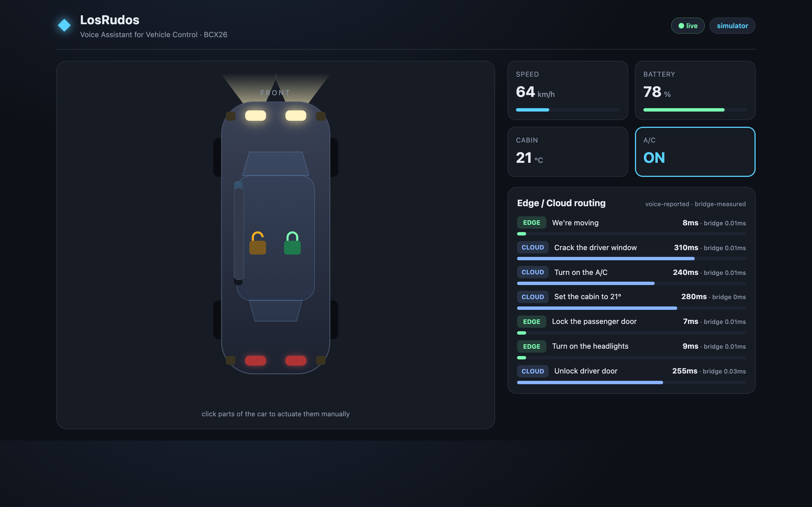

# **Your Team at a Glance**

## **Team Name / Tagline**

**LosRudos** — *Voice-driven intelligence for the road ahead*

> 💡 **Tip:** Create a sheet of paper with your team name on the desk so mentors and organizers can find you easily! 

## **Team Members**

| Name | GitHub Handle | Role(s) |
| :--- | :--- | :--- |
| | [@kronos-cm](https://github.com/kronos-cm) | |
| | [@jesusalc](https://github.com/jesusalc) | |
| | [@carloshled](https://github.com/carloshled) | |

## **Challenge**

**Voice Assistant for Vehicle Control** — Future Mobility (Automotive)

Build a hybrid AI-powered in-vehicle voice assistant that intelligently routes commands between edge and cloud systems to enable fast, reliable, real-time vehicle control.

## **Core Idea**

A modular voice-enabled solution that is a cutting-edge integration of AI technologies with automotive safety systems, designed to redefine the driving experience. Fully integrated with Kuksa Vehicle API.

---

## Demo dashboard

A live dashboard that shows a car and reflects vehicle actions in real time, plus
a panel that visualizes the challenge's differentiator: per-command **edge vs
cloud** routing and latency.



### Architecture

```
🎙 voice AI ─POST /command─▶ ┌──────────────┐ ─set_current_values─▶ ┌──────────────────┐
   (route + latency)         │  bridge      │ ◀──subscribe──────────│ Kuksa Databroker │
                             │ (FastAPI)    │     (gRPC, optional)   │  (VSS = truth)   │
 dashboard ◀──WebSocket──────│              │                        └──────────────────┘
   (car + routing panel)     └──────────────┘
```

Kuksa is the single source of truth: the voice system **writes** VSS signals, the
dashboard **subscribes** to them. Neither talks to the other directly. The bridge
runs as a **pure in-memory simulator** when no databroker is configured, so the
demo works with zero infrastructure — set `KUKSA_ADDRESS` to bridge a real one.

### Run it

```bash
# 1) bridge  (simulator mode — no databroker needed)
cd bridge
pip install -r requirements.txt
uvicorn main:app --port 8000
#   real Kuksa instead:  KUKSA_ADDRESS=127.0.0.1 uvicorn main:app --port 8000

# 2) dashboard
cd dashboard
npm install
npm run dev            # open the printed http://localhost:5173

# 3) make the car move without the voice pipeline
cd bridge
python poke.py         # add --loop for a continuously replaying demo
```

You can also click parts of the car to actuate them by hand.

### Voice-system integration contract

The voice AI integrates through **one HTTP call** per executed action — it owns
the edge/cloud routing *decision* and latency *measurement*; the bridge renders
them and adds its own measured `bridge_ms`:

```http
POST /command
{
  "intent": "Turn on the headlights",
  "path":   "Vehicle.Body.Lights.Beam.Low.IsOn",   // a VSS signal path
  "value":  true,
  "route":  "edge",        // "edge" | "cloud" — the router's decision
  "latency_ms": 9          // the latency the voice system measured
}
```

Other endpoints: `GET /signals` (catalog + current values), `GET /healthz`
(mode + Kuksa connection), `WS /ws` (live `snapshot` / `update` / `command`
frames; send `{type:"set", path, value}` to actuate from the UI).

> ⚠️ **VSS paths**: the signal paths in `bridge/signals.py` follow recent VSS
> naming. Exact names differ between VSS versions — confirm them against the
> `vss.json` your databroker actually loaded (`kuksa-client` → `getValue`/
> `getMetaData`) before wiring the live databroker.
