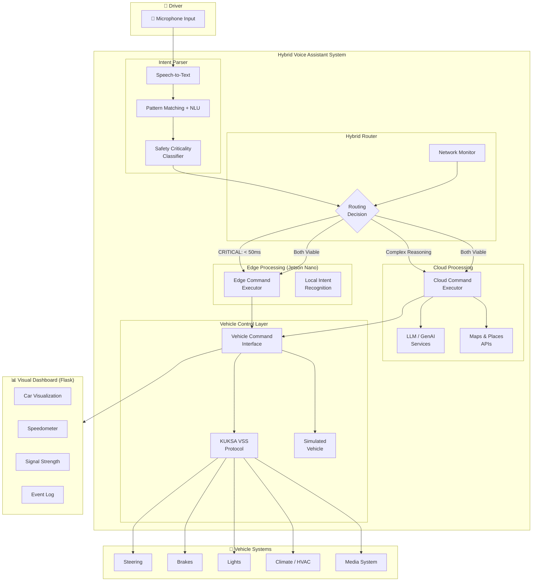
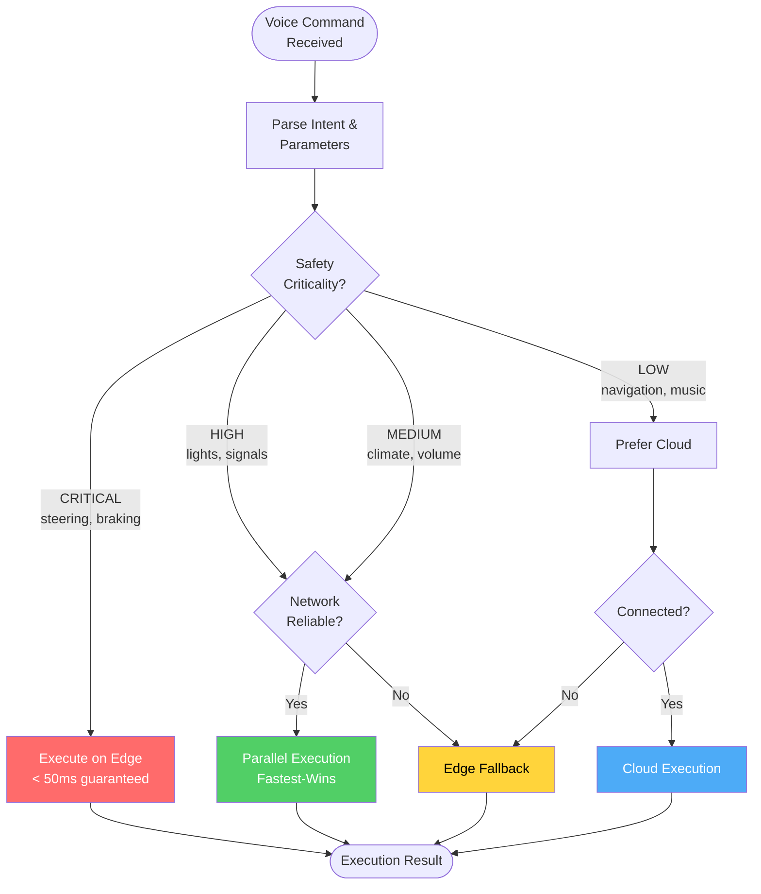
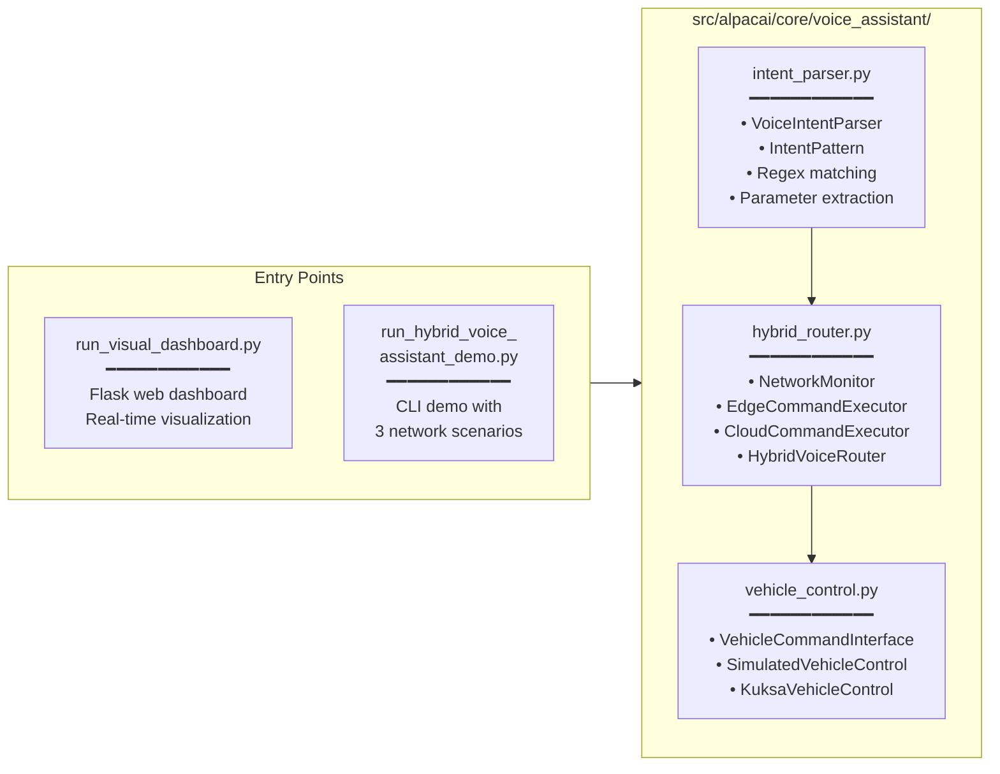
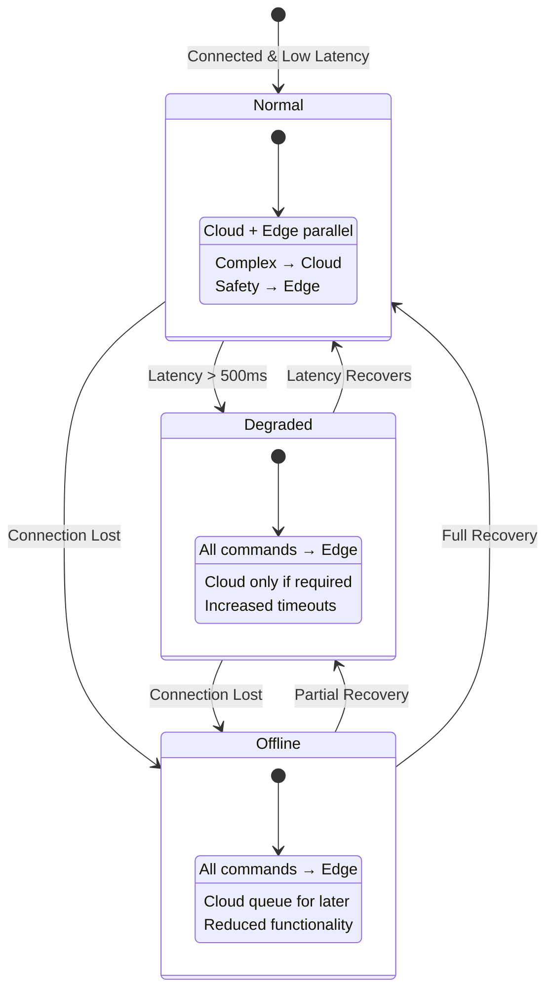

# Hybrid Voice Assistant — System Architecture

## High-Level Architecture

## Routing Decision Flow

## Component Breakdown

## Latency Targets

| Command Type | Target Latency | Execution Location | Example |
|---|---|---|---|
| Safety-Critical | **< 50ms** | Edge Only | Emergency brake, steering |
| High Priority | **< 100ms** | Edge Primary | Hazard lights, turn signals |
| Standard | **< 500ms** | Parallel (fastest-wins) | Climate, volume |
| Complex | **< 2000ms** | Cloud Primary | Navigation, restaurant search |

## Network Degradation Strategy

## Technology Stack

| Layer | Technology | Purpose |
|---|---|---|
| Voice Input | Google Cloud Speech / Local ASR | Speech-to-text |
| Intent Parsing | Regex patterns + LLM fallback | Command understanding |
| Edge Runtime | Jetson Nano (Python 3.10+) | Local command execution |
| Cloud AI | Vertex AI / Gemini | Complex reasoning |
| Vehicle Protocol | Eclipse KUKSA (VSS) | Vehicle signal access |
| Dashboard | Flask + SVG + JavaScript | Real-time visualization |
| Container | Docker Compose | Deployment |
