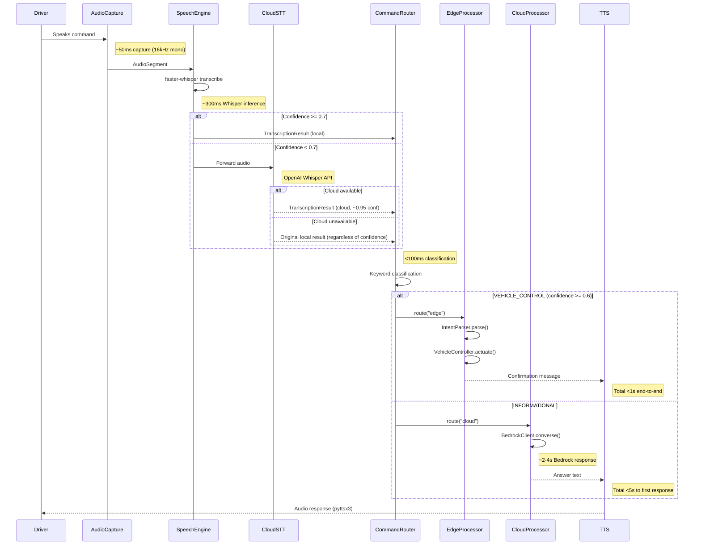

# Speech-to-Command Pipeline (Online)

```mermaid
sequenceDiagram
    participant Driver
    participant AudioCapture
    participant SpeechEngine
    participant CloudSTT
    participant CommandRouter
    participant EdgeProcessor
    participant CloudProcessor
    participant TTS

    Driver->>AudioCapture: Speaks command
    Note right of AudioCapture: ~50ms capture (16kHz mono)
    AudioCapture->>SpeechEngine: AudioSegment

    SpeechEngine->>SpeechEngine: faster-whisper transcribe
    Note right of SpeechEngine: ~300ms Whisper inference

    alt Confidence >= 0.7
        SpeechEngine->>CommandRouter: TranscriptionResult (local)
    else Confidence < 0.7
        SpeechEngine->>CloudSTT: Forward audio
        Note right of CloudSTT: OpenAI Whisper API
        alt Cloud available
            CloudSTT-->>CommandRouter: TranscriptionResult (cloud, ~0.95 conf)
        else Cloud unavailable
            CloudSTT-->>CommandRouter: Original local result (regardless of confidence)
        end
    end

    Note right of CommandRouter: <100ms classification
    CommandRouter->>CommandRouter: Keyword classification

    alt VEHICLE_CONTROL (confidence >= 0.6)
        CommandRouter->>EdgeProcessor: route("edge")
        EdgeProcessor->>EdgeProcessor: IntentParser.parse()
        EdgeProcessor->>EdgeProcessor: VehicleController.actuate()
        EdgeProcessor-->>TTS: Confirmation message
        Note right of TTS: Total <1s end-to-end
    else INFORMATIONAL
        CommandRouter->>CloudProcessor: route("cloud")
        CloudProcessor->>CloudProcessor: BedrockClient.converse()
        Note right of CloudProcessor: ~2-4s Bedrock response
        CloudProcessor-->>TTS: Answer text
        Note right of TTS: Total <5s to first response
    end

    TTS-->>Driver: Audio response (pyttsx3)
```
