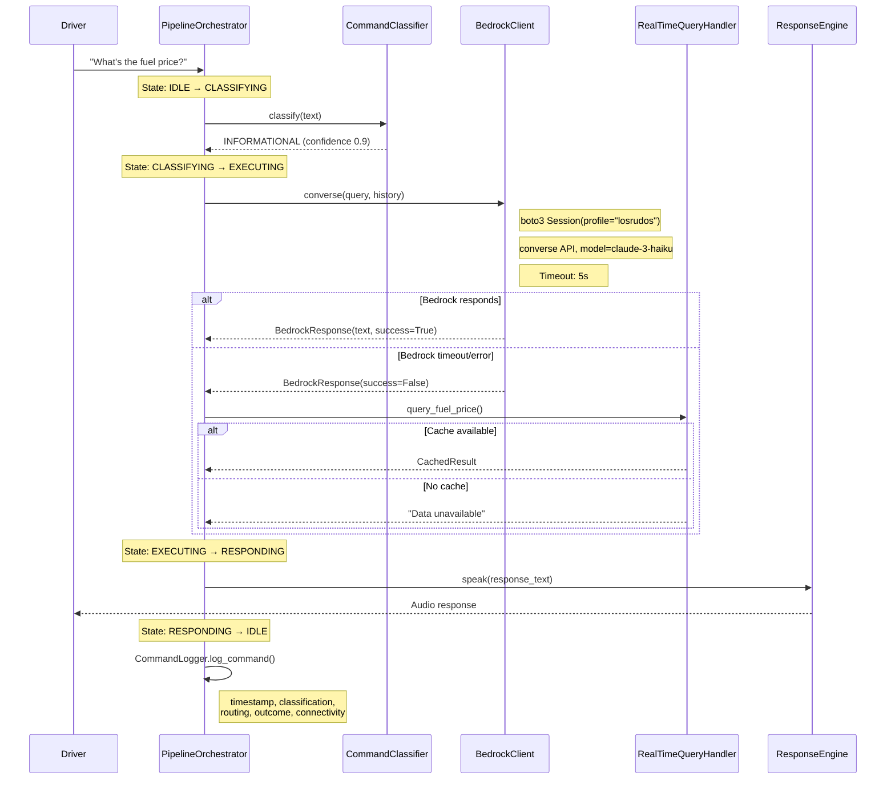

# Online Query Processing

```mermaid
sequenceDiagram
    participant Driver
    participant Pipeline as PipelineOrchestrator
    participant Classifier as CommandClassifier
    participant Bedrock as BedrockClient
    participant RealTime as RealTimeQueryHandler
    participant TTS as ResponseEngine

    Driver->>Pipeline: "What's the fuel price?"
    Note over Pipeline: State: IDLE → CLASSIFYING

    Pipeline->>Classifier: classify(text)
    Classifier-->>Pipeline: INFORMATIONAL (confidence 0.9)
    Note over Pipeline: State: CLASSIFYING → EXECUTING

    Pipeline->>Bedrock: converse(query, history)
    Note right of Bedrock: boto3 Session(profile="losrudos")
    Note right of Bedrock: converse API, model=claude-3-haiku
    Note right of Bedrock: Timeout: 5s

    alt Bedrock responds
        Bedrock-->>Pipeline: BedrockResponse(text, success=True)
    else Bedrock timeout/error
        Bedrock-->>Pipeline: BedrockResponse(success=False)
        Pipeline->>RealTime: query_fuel_price()
        alt Cache available
            RealTime-->>Pipeline: CachedResult
        else No cache
            RealTime-->>Pipeline: "Data unavailable"
        end
    end

    Note over Pipeline: State: EXECUTING → RESPONDING
    Pipeline->>TTS: speak(response_text)
    TTS-->>Driver: Audio response
    Note over Pipeline: State: RESPONDING → IDLE

    Pipeline->>Pipeline: CommandLogger.log_command()
    Note right of Pipeline: timestamp, classification,<br/>routing, outcome, connectivity
```
