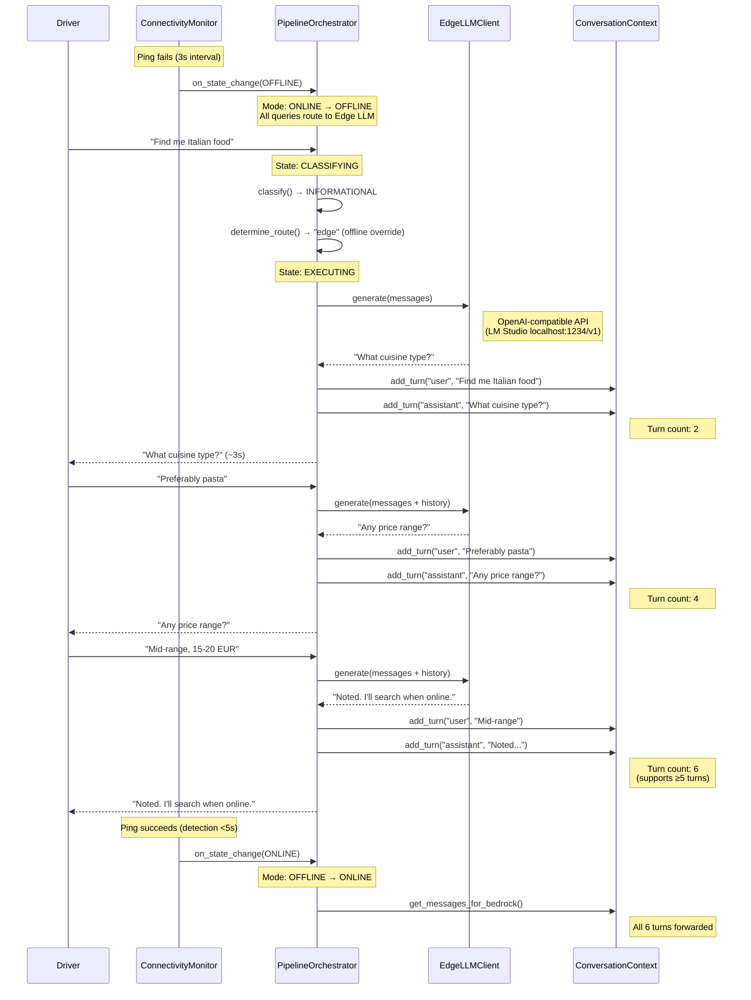

# Offline Conversational Follow-up

```mermaid
sequenceDiagram
    participant Driver
    participant ConnMonitor as ConnectivityMonitor
    participant Pipeline as PipelineOrchestrator
    participant EdgeLLM as EdgeLLMClient
    participant Context as ConversationContext

    Note over ConnMonitor: Ping fails (3s interval)
    ConnMonitor->>Pipeline: on_state_change(OFFLINE)
    Note over Pipeline: Mode: ONLINE → OFFLINE<br/>All queries route to Edge LLM

    Driver->>Pipeline: "Find me Italian food"
    Note over Pipeline: State: CLASSIFYING
    Pipeline->>Pipeline: classify() → INFORMATIONAL
    Pipeline->>Pipeline: determine_route() → "edge" (offline override)

    Note over Pipeline: State: EXECUTING
    Pipeline->>EdgeLLM: generate(messages)
    Note right of EdgeLLM: OpenAI-compatible API<br/>(LM Studio localhost:1234/v1)
    EdgeLLM-->>Pipeline: "What cuisine type?"
    Pipeline->>Context: add_turn("user", "Find me Italian food")
    Pipeline->>Context: add_turn("assistant", "What cuisine type?")
    Note right of Context: Turn count: 2
    Pipeline-->>Driver: "What cuisine type?" (~3s)

    Driver->>Pipeline: "Preferably pasta"
    Pipeline->>EdgeLLM: generate(messages + history)
    EdgeLLM-->>Pipeline: "Any price range?"
    Pipeline->>Context: add_turn("user", "Preferably pasta")
    Pipeline->>Context: add_turn("assistant", "Any price range?")
    Note right of Context: Turn count: 4
    Pipeline-->>Driver: "Any price range?"

    Driver->>Pipeline: "Mid-range, 15-20 EUR"
    Pipeline->>EdgeLLM: generate(messages + history)
    EdgeLLM-->>Pipeline: "Noted. I'll search when online."
    Pipeline->>Context: add_turn("user", "Mid-range")
    Pipeline->>Context: add_turn("assistant", "Noted...")
    Note right of Context: Turn count: 6<br/>(supports ≥5 turns)
    Pipeline-->>Driver: "Noted. I'll search when online."

    Note over ConnMonitor: Ping succeeds (detection <5s)
    ConnMonitor->>Pipeline: on_state_change(ONLINE)
    Note over Pipeline: Mode: OFFLINE → ONLINE

    Pipeline->>Context: get_messages_for_bedrock()
    Note right of Context: All 6 turns forwarded
```
