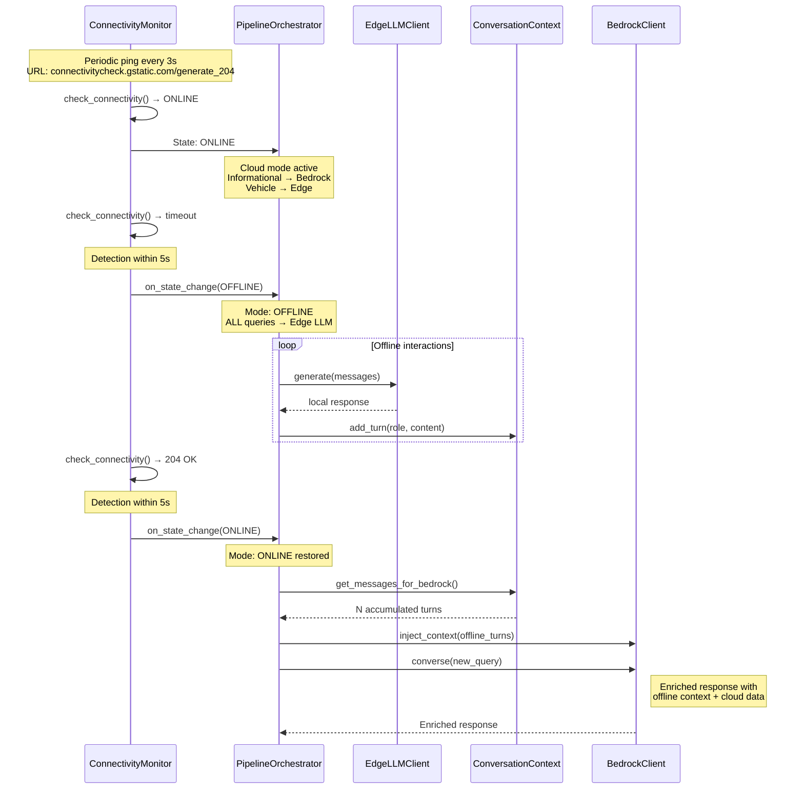

# Connectivity Transition

```mermaid
sequenceDiagram
    participant ConnMonitor as ConnectivityMonitor
    participant Pipeline as PipelineOrchestrator
    participant EdgeLLM as EdgeLLMClient
    participant Context as ConversationContext
    participant Bedrock as BedrockClient

    Note over ConnMonitor: Periodic ping every 3s<br/>URL: connectivitycheck.gstatic.com/generate_204

    ConnMonitor->>ConnMonitor: check_connectivity() → ONLINE
    ConnMonitor->>Pipeline: State: ONLINE
    Note over Pipeline: Cloud mode active<br/>Informational → Bedrock<br/>Vehicle → Edge

    ConnMonitor->>ConnMonitor: check_connectivity() → timeout
    Note over ConnMonitor: Detection within 5s
    ConnMonitor->>Pipeline: on_state_change(OFFLINE)
    Note over Pipeline: Mode: OFFLINE<br/>ALL queries → Edge LLM

    loop Offline interactions
        Pipeline->>EdgeLLM: generate(messages)
        EdgeLLM-->>Pipeline: local response
        Pipeline->>Context: add_turn(role, content)
    end

    ConnMonitor->>ConnMonitor: check_connectivity() → 204 OK
    Note over ConnMonitor: Detection within 5s
    ConnMonitor->>Pipeline: on_state_change(ONLINE)
    Note over Pipeline: Mode: ONLINE restored

    Pipeline->>Context: get_messages_for_bedrock()
    Context-->>Pipeline: N accumulated turns
    Pipeline->>Bedrock: inject_context(offline_turns)
    Pipeline->>Bedrock: converse(new_query)
    Note right of Bedrock: Enriched response with<br/>offline context + cloud data
    Bedrock-->>Pipeline: Enriched response
```
