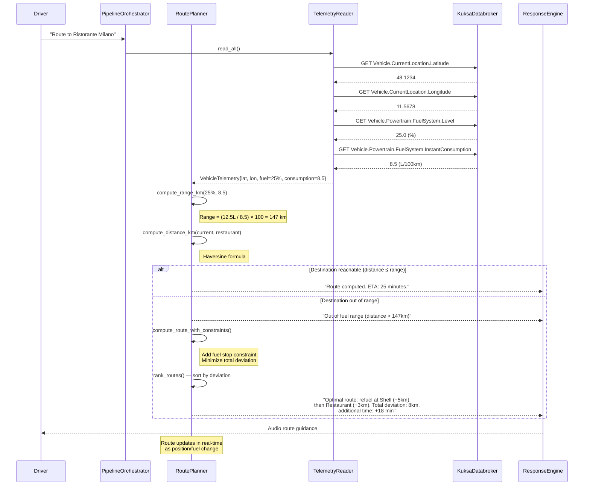

# Fuel-Aware Route Planning

```mermaid
sequenceDiagram
    participant Driver
    participant Pipeline as PipelineOrchestrator
    participant Planner as RoutePlanner
    participant Telemetry as TelemetryReader
    participant Kuksa as KuksaDatabroker
    participant TTS as ResponseEngine

    Driver->>Pipeline: "Route to Ristorante Milano"
    Pipeline->>Telemetry: read_all()

    Telemetry->>Kuksa: GET Vehicle.CurrentLocation.Latitude
    Kuksa-->>Telemetry: 48.1234
    Telemetry->>Kuksa: GET Vehicle.CurrentLocation.Longitude
    Kuksa-->>Telemetry: 11.5678
    Telemetry->>Kuksa: GET Vehicle.Powertrain.FuelSystem.Level
    Kuksa-->>Telemetry: 25.0 (%)
    Telemetry->>Kuksa: GET Vehicle.Powertrain.FuelSystem.InstantConsumption
    Kuksa-->>Telemetry: 8.5 (L/100km)

    Telemetry-->>Planner: VehicleTelemetry{lat, lon, fuel=25%, consumption=8.5}

    Planner->>Planner: compute_range_km(25%, 8.5)
    Note right of Planner: Range = (12.5L / 8.5) × 100 = 147 km

    Planner->>Planner: compute_distance_km(current, restaurant)
    Note right of Planner: Haversine formula

    alt Destination reachable (distance ≤ range)
        Planner-->>TTS: "Route computed. ETA: 25 minutes."
    else Destination out of range
        Planner-->>TTS: "Out of fuel range (distance > 147km)"
        Planner->>Planner: compute_route_with_constraints()
        Note right of Planner: Add fuel stop constraint<br/>Minimize total deviation

        Planner->>Planner: rank_routes() — sort by deviation
        Planner-->>TTS: "Optimal route: refuel at Shell (+5km),<br/>then Restaurant (+3km). Total deviation: 8km,<br/>additional time: +18 min"
    end

    TTS-->>Driver: Audio route guidance

    Note over Planner: Route updates in real-time<br/>as position/fuel change
```
