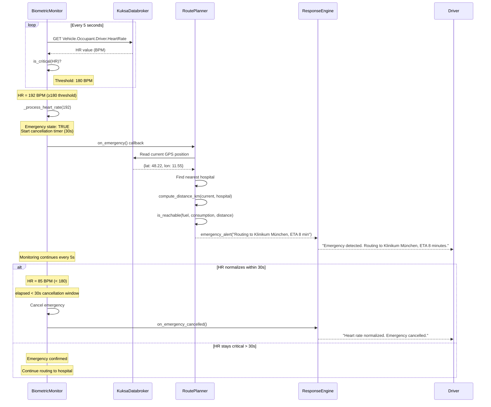

# Emergency Biometric Response

```mermaid
sequenceDiagram
    participant Biometric as BiometricMonitor
    participant Kuksa as KuksaDatabroker
    participant Planner as RoutePlanner
    participant TTS as ResponseEngine
    participant Driver

    loop Every 5 seconds
        Biometric->>Kuksa: GET Vehicle.Occupant.Driver.HeartRate
        Kuksa-->>Biometric: HR value (BPM)
        Biometric->>Biometric: is_critical(HR)?
        Note right of Biometric: Threshold: 180 BPM
    end

    Note over Biometric: HR = 192 BPM (≥180 threshold)
    Biometric->>Biometric: _process_heart_rate(192)
    Note over Biometric: Emergency state: TRUE<br/>Start cancellation timer (30s)

    Biometric->>Planner: on_emergency() callback
    Planner->>Kuksa: Read current GPS position
    Kuksa-->>Planner: {lat: 48.22, lon: 11.55}

    Planner->>Planner: Find nearest hospital
    Planner->>Planner: compute_distance_km(current, hospital)
    Planner->>Planner: is_reachable(fuel, consumption, distance)

    Planner-->>TTS: emergency_alert("Routing to Klinikum München, ETA 8 min")
    TTS-->>Driver: "Emergency detected. Routing to Klinikum München, ETA 8 minutes."

    Note over Biometric: Monitoring continues every 5s

    alt HR normalizes within 30s
        Note over Biometric: HR = 85 BPM (< 180)
        Note over Biometric: elapsed < 30s cancellation window
        Biometric->>Biometric: Cancel emergency
        Biometric->>TTS: on_emergency_cancelled()
        TTS-->>Driver: "Heart rate normalized. Emergency cancelled."
    else HR stays critical > 30s
        Note over Biometric: Emergency confirmed
        Note over Biometric: Continue routing to hospital
    end
```
