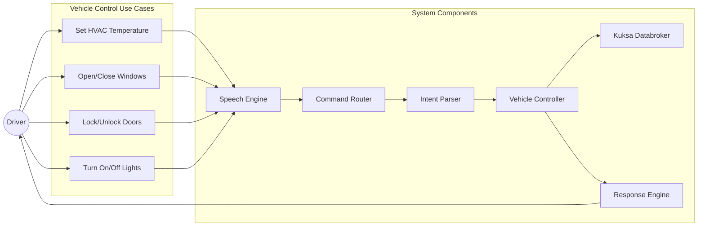
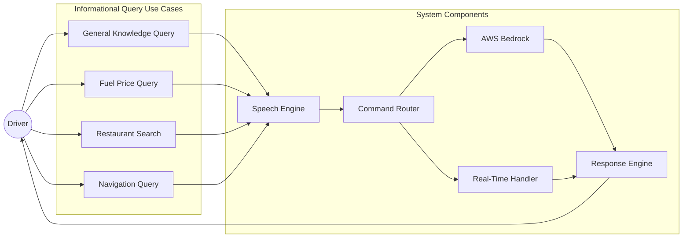
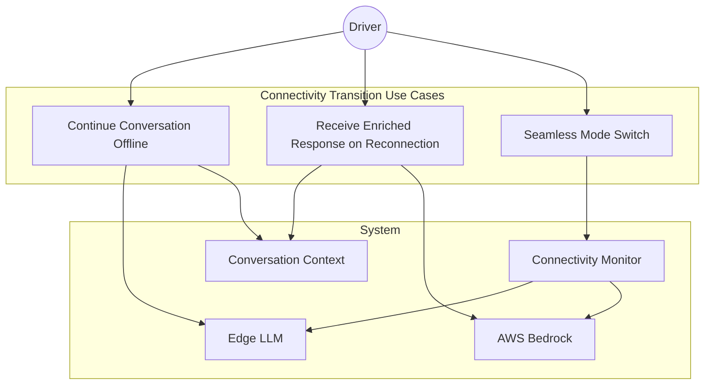
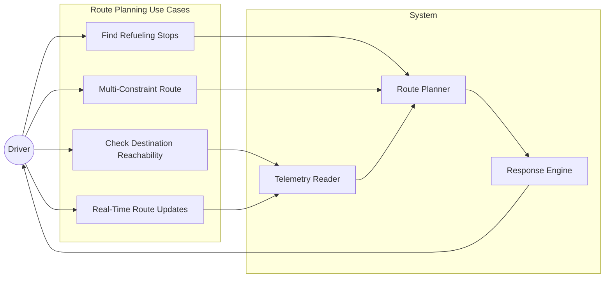
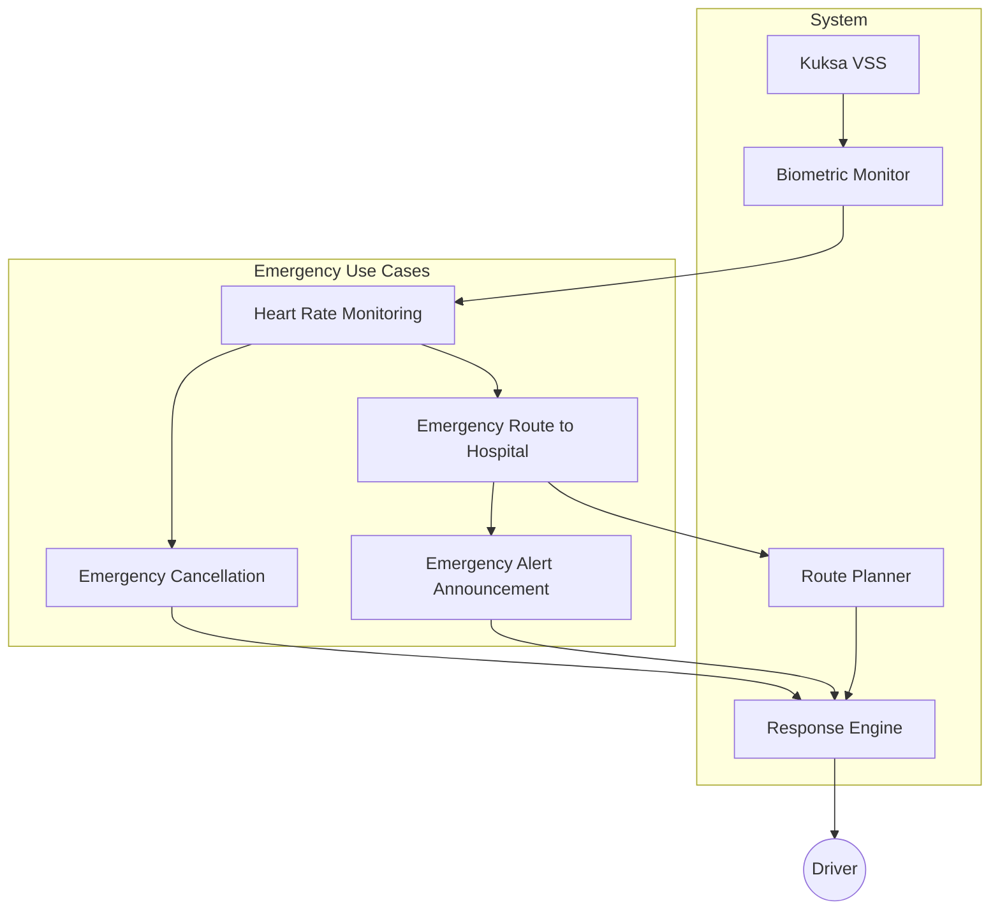

# Use Case Diagrams

## Use Case 1: Vehicle Control Commands

## Use Case 2: Informational Queries

## Use Case 3: Offline-to-Online Transitions

## Use Case 4: Fuel-Constrained Routing

## Use Case 5: Emergency Response

